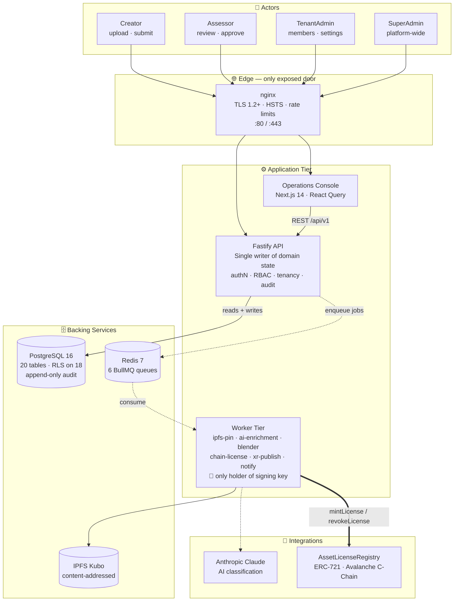
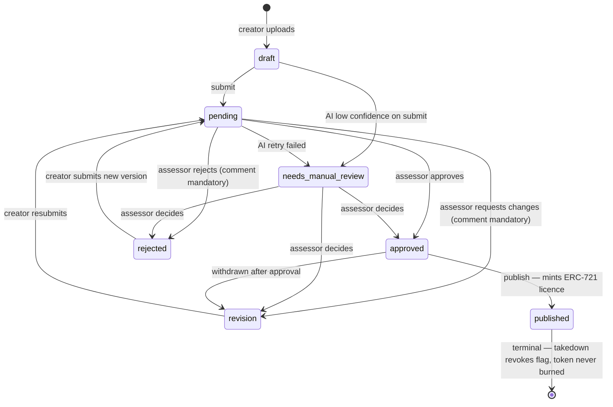
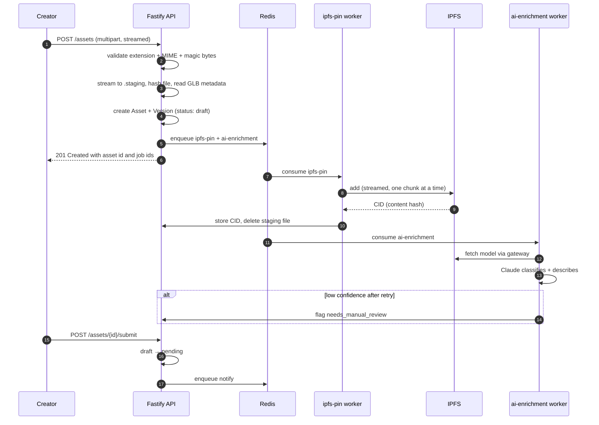
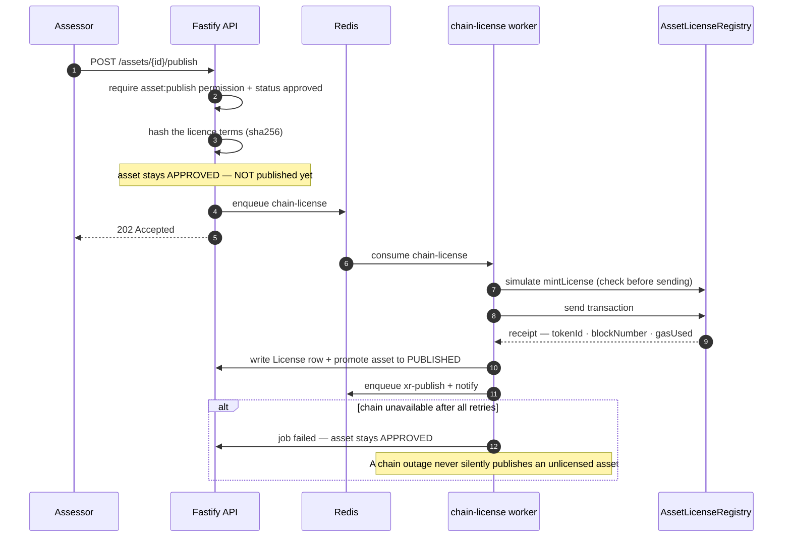
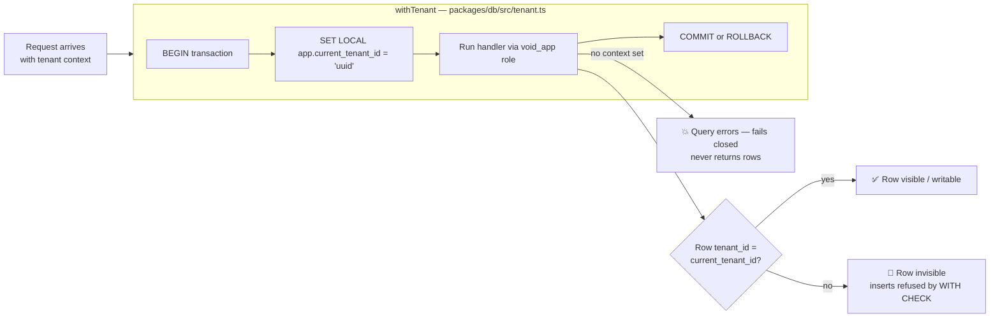
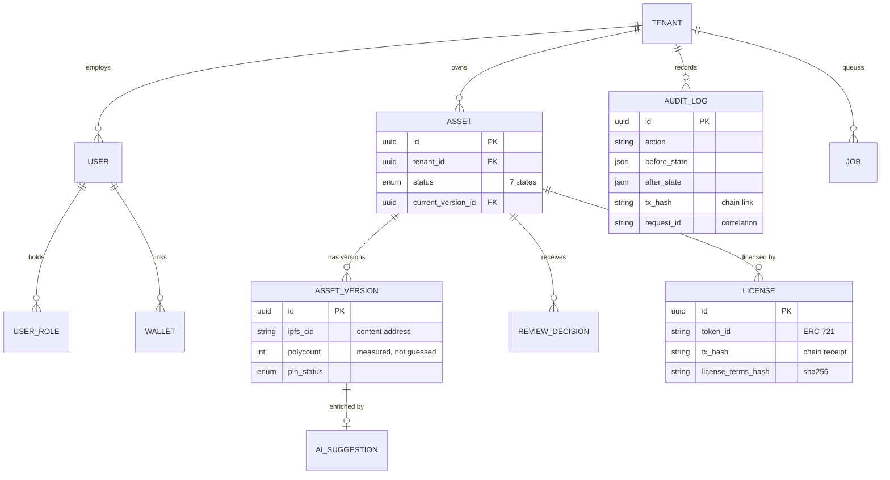
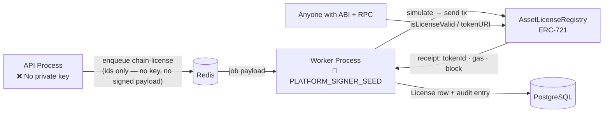
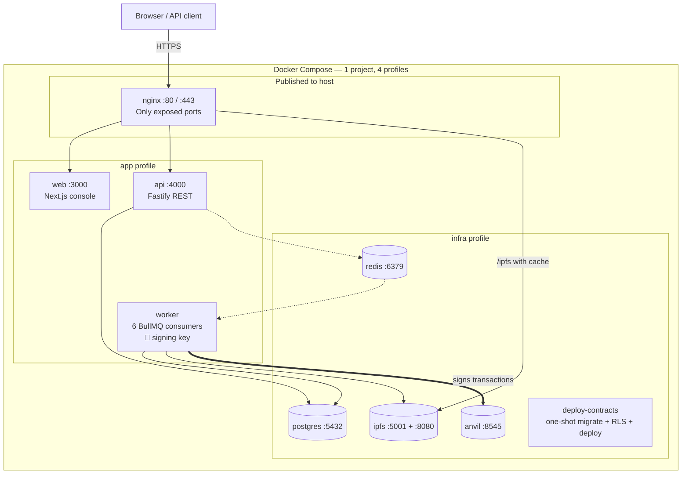
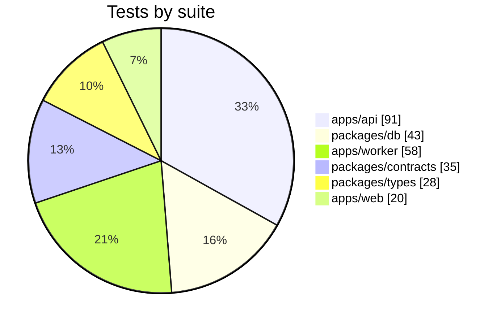

# VOID·SPACE — Platform Architecture
> **Multi-tenant 3D/XR asset lifecycle** · Upload → AI Review → IPFS → On-Chain Licence → XR Delivery

> **⚠ This file is an older hand-maintained snapshot.** The living documents are
> `docs/architecture.md` and `docs/FR-traceability.md`; the counts and the roadmap here were
> duplicated from them by hand and had drifted (it read "224 tests / 19 tables / 51 operations" until
> a later pass corrected it to 275 / 20 / 69 against the running system). It is correct as of that
> pass, and nothing in it is authoritative — check `architecture.md` before quoting a number.

---

## At a Glance

| 🧱 10 Containers | ✅ 275 Tests | 🔌 69 API Operations | 🔒 18 RLS Tables | ⛓️ ERC-721 Licences |
|:---:|:---:|:---:|:---:|:---:|
| 4 Docker profiles | 0 lint warnings | 63 paths · OpenAPI 3 | Forced on every tenant table | Avalanche C-Chain target |

---

## System Architecture



> **Arrow guide:** Solid = synchronous · Dashed = async queue hand-off · **Bold red path** = licensing (the only path that touches the blockchain and the only one run by a process with a private key)

---

## Layered Responsibilities

| Layer | Owns | Must Never | Enforced By |
|-------|------|------------|-------------|
| **Client** | Presentation · 3D preview | Hold secrets · Talk to DB/IPFS/chain directly | All calls go through `apps/web/src/lib/api.ts` |
| **Edge** | TLS · routing · rate limits · gateway cache | Contain business rules | `docker/nginx/templates/default.conf.template` |
| **API** | Auth · tenancy · validation · domain state · audit | Hold a chain private key · Run slow jobs inline | No signing key in env; every slow op is enqueued |
| **Worker** | AI · IPFS · Blender · chain transactions · notify | Serve HTTP · Own auth decisions | Separate process; only it receives `PLATFORM_SIGNER_SEED` |
| **Data** | System of record · tenant isolation · audit history | Be bypassed without tenant context | `RLS FORCE` + `void_app` role + `assertRlsEnforced()` at boot |
| **Chain** | Immutable licence record and provenance | Store mutable business state | Only identity, terms hash, metadata CID written on-chain |

---

## Asset Lifecycle



> ⚠️ **Self-review is blocked** — an assessor cannot review their own asset. Comments are **mandatory** for `rejected` and `revision`. Only `pending` and `needs_manual_review` appear in the review queue.

---

## Ingestion Pipeline



---

## Publication & On-Chain Licensing



---

## Async Job Platform — 6 BullMQ Queues

| Queue | Attempts | Backoff | Concurrency | On Exhaustion |
|-------|:---:|--------|:---:|---------------|
| `ai-enrichment` | 2 | fixed 2s | 2 | Stricter retry → `needs_manual_review` |
| `ipfs-pin` | 3 | exponential 2s | 4 | Version marked `pinStatus: failed` |
| `blender-optimize` | 2 | exponential 5s | 1 | Failure surfaced; original version untouched |
| `chain-license` | 3 | exponential 3s | 2 | Job failed · asset stays `approved` — **never silently published** |
| `xr-publish` | 3 | exponential 3s | 2 | Retried; doesn't affect licence validity |
| `notify` | 2 | fixed 1s | 4 | Best-effort; lost notification never blocks the workflow |

> Every job is mirrored to a `jobs` Postgres row — the console can diagnose stuck work from SQL without Redis tooling.

---

## Multi-Tenancy & Row-Level Security



**Three database roles:**

| Role | Used By | Privileges |
|------|---------|------------|
| `void_app` | API + Worker (runtime) | Full DML — but FORCE RLS on every tenant table |
| `void_platform` | API (narrow paths only) | `BYPASSRLS` — but grants **only** on `tenants, roles, users, user_roles, wallets, invites`. No access to assets, licences, or audit logs |
| Schema owner | Migrations only | DDL — never serves a request |

**17 tenant-isolated tables (+ `tenants` = 18 under RLS):**
`users` · `user_roles` · `wallets` · `invites` · `tenant_settings` · `webhooks` · `assets` · `asset_versions` · `ai_suggestions` · `review_decisions` · `review_comments` · `licenses` · `api_keys` · `notifications` · `audit_logs` · `jobs` · `sessions`

---

## Role Permissions Matrix (RBAC)

| Capability | Creator | Assessor | TenantAdmin | Developer | Viewer | SuperAdmin |
|------------|:-------:|:--------:|:-----------:|:---------:|:------:|:----------:|
| Upload & edit own assets | ✅ | ❌ | ✅ | ❌ | ❌ | ✅ |
| Submit for review | ✅ | ❌ | ✅ | ❌ | ❌ | ✅ |
| View review queue | ❌ | ✅ | ✅ | ❌ | ❌ | ✅ |
| Approve / Reject / Revision | ❌ | ✅ | ✅ | ❌ | ❌ | ✅ |
| Publish (mint licence) | ❌ | ✅ | ✅ | ❌ | ❌ | ✅ |
| Revoke licence (takedown) | ❌ | ❌ | ✅ | ❌ | ❌ | ✅ |
| Manage members & roles | ❌ | ❌ | ✅ | ❌ | ❌ | ✅ |
| Create & rotate API keys | ❌ | ❌ | ✅ | ✅ | ❌ | ✅ |
| View audit ledger | ❌ | ❌ | ✅ | ❌ | ❌ | ✅ |
| Manage tenants (platform) | ❌ | ❌ | ❌ | ❌ | ❌ | ✅ |
| Catalogue / REST read | ❌ | ❌ | ❌ | ✅ | ✅ | ✅ |

---

## Data Model



> `audit_logs` is **append-only by grant** — the runtime role holds no `UPDATE` or `DELETE` on it. `licenses.asset_version_id` binds the licence to a specific file, not just the asset identity.

---

## Blockchain Subsystem



**Chain functions:**

| Function | Purpose |
|----------|---------|
| `mintLicense()` | Publisher-only · mints token · records terms hash + metadata CID |
| `revokeLicense()` | Marks licence revoked · **token is NOT burned** |
| `isLicenseValid()` | What the marketplace and XR consumers call |
| `tokenURI()` | Resolves to IPFS metadata document |

**Dev → Production migration = configuration only:**

| Concern | Dev (now) | Production target | Code change |
|---------|-----------|-------------------|-------------|
| Chain | Anvil · chain id 31337 | Avalanche C-Chain | 1 constant |
| RPC | `http://anvil:8545` | HTTPS provider | 1 env var |
| Signing key | Dev seed | Managed/HSM signer | Secret only |
| Contract | `AssetLicenseRegistry` | Same bytecode · same ABI | **None** |

---

## Deployment Topology



**Bring-up sequence (`pnpm dev:up` — idempotent):**

```
① Start infra (postgres, redis, ipfs, anvil) → wait for health checks
② Generate dev TLS certificates
③ deploy-contracts: Prisma migrate → apply RLS → deploy ERC-721 → write CONTRACT_ADDRESS
④ Verify RLS coverage
⑤ Seed tenants, roles, users, assets (idempotent, safe to re-run)
⑥ Start edge + app services
```

---

## Security Controls

| Concern | Control |
|---------|---------|
| 🔒 **Transport** | TLS 1.2+ only · HSTS · HTTP → HTTPS redirect at edge |
| 🛡️ **Brute force** | nginx rate limits 50 r/s (API), 100 r/s (general) + per-endpoint auth limits |
| 🔒 **Passwords** | bcrypt cost 12 · API keys and refresh tokens stored as hashes only |
| 🛡️ **Sessions** | Short-lived access tokens · rotating refresh tokens · reuse detection revokes the whole session family |
| 🔒 **Cookies** | `HttpOnly` + `Secure` + `SameSite=Lax` · refresh cookie path-scoped to `/api/v1/auth` |
| 🛡️ **Tenant isolation** | Forced RLS on 18 tables · boot-time assertion refuses to start with a bypassing role |
| 🔒 **Upload validation** | Extension + MIME + magic-byte sniffing + 200 MB ceiling |
| 🛡️ **Enumeration** | Assets a caller can't see answer `404`, not `403` — can't be used to probe another workspace |
| 🔒 **Chain key** | No signing key in the API environment; job payloads carry identifiers only |
| 🛡️ **Supply chain** | Zero external Solidity dependencies · lockfile committed |

---

## Test Coverage — 275 Tests



| Suite | Tests | What it proves |
|-------|:-----:|----------------|
| `apps/api` | 91 | Auth flows · RBAC matrix · tenant isolation · lifecycle transitions · publication guards |
| `packages/db` | 43 | RLS coverage · cross-tenant invisibility · append-only audit · GLB fixture integrity |
| `apps/worker` | 58 | Queue policy · enrichment fallbacks · chain client · job bookkeeping |
| `packages/contracts` | 35 | Mint · revocation as flag · token metadata · idempotency (Foundry) |
| `packages/types` | 28 | Lifecycle and permission matrices match SRS table cell by cell |
| `apps/web` | 20 | Mesh-statistics comparison · client-side contract behaviour |
| **Total** | **275** | + 12 typecheck tasks · 0 lint warnings · 8 build tasks |

> Tests run against the **real stack** — real Postgres with real RLS policies, real Redis, real EVM chain. Cross-tenant isolation tested against a mock would prove nothing.

---

## Roadmap

```mermaid
flowchart LR
    subgraph DONE["✅ Built & Verified"]
        D1["Ingestion · IPFS · AI · Review"]
        D2["ERC-721 Licensing · Takedown"]
        D3["Console · Audit · Notifications"]
        D4["RBAC · RLS · SSO · SIWE · API keys"]
        D5["Blender conversion\\nprocessor · runner service · protocol"]
        D6["Importers: Sketchfab · Poly Pizza · Meshy\\nadapters reachable"]
        D7["Outbound webhooks · UC-09 import"]
        D8["Public catalogue"]
    end

    subgraph NEXT["🔌 Needs a Third-Party Account"]
        N1["Blender conversion, real mode\\nneeds the ~1 GB image"]
        N2["Vendor APIs\\nneed keys and outbound network"]
        N3["Email delivery"]
    end

    subgraph LATER["🔧 Production Hardening"]
        L1["Avalanche C-Chain + managed signer"]
        L2["IPFS pinning service · redundant"]
        L3["Horizontal worker scaling"]
        L4["Playwright E2E suite"]
    end

    DONE --> NEXT --> LATER
```



---

*VOID·SPACE Platform Architecture v2.0 — all counts read from the running system.*
