<!--
═════════════════════════════════════════════════════════════════════════════════════════════════
  VOID·SPACE · PLATFORM ARCHITECTURE · v2.0
  -----------------------------------------------------------------------------------------------
  Print-safety contract for this file:
    * every diagram in the body is ASCII/Unicode inside a ```text fence — no Mermaid, no
      JavaScript, no web font and no image file, so it renders identically in every
      Markdown → PDF pipeline (pandoc, VS Code, Typora, Obsidian, Chrome print, others)
    * every matrix, comparison and decision list is a plain Markdown table
    * the Mermaid twin of each diagram lives in Appendix A, below the "PDF EXCLUDE" marker,
      which scripts/docs-pdf.sh strips before conversion — so the printed document never
      contains a wall of unrendered diagram source
  Convert this file:  pnpm docs:pdf      (see §25 for the pipeline and each converter's caveats)
═════════════════════════════════════════════════════════════════════════════════════════════════
-->

# VOID·SPACE — Platform Architecture

**Version 2.0 · Multi-tenant 3D/XR asset lifecycle platform**
Ingestion → AI-assisted classification → human review → content-addressed storage on IPFS →
on-chain licence issuance → XR delivery.

```text
╔════════════════════════════════════════════════════════════════════════════════════════╗
║                                                                                        ║
║           ██╗   ██╗  ██████╗ ██╗ ██████╗  ███████╗ ██████╗   █████╗   ██████╗ ███████╗ ║
║           ██║   ██║ ██╔═══██╗██║ ██╔══██╗  ██╔════╝ ██╔══██╗ ██╔══██╗ ██╔════╝ ██╔════ ║
║           ██║   ██║ ██║   ██║██║ ██║  ██║  ███████╗ ██████╔╝ ███████║ ██║      █████╗  ║
║           ╚██╗ ██╔╝ ██║   ██║██║ ██║  ██║  ╚════██║ ██╔═══╝  ██╔══██║ ██║      ██╔══╝  ║
║            ╚████╔╝  ╚██████╔╝██║ ██████╔╝  ███████║ ██║      ██║  ██║ ╚██████╗ ███████ ║
║             ╚═══╝    ╚═════╝ ╚═╝ ╚═════╝   ╚══════╝ ╚═╝      ╚═╝  ╚═╝  ╚═════╝ ╚══════ ║
║                                                                                        ║
║   PLATFORM ARCHITECTURE   ·   v2.0                                                     ║
║   Multi-tenant 3D / XR asset lifecycle platform                                        ║
║                                                                                        ║
║   ingest  ──▶  govern  ──▶  licence on chain  ──▶  deliver to XR                       ║
║                                                                                        ║
║   224 tests   ·   19 tables   ·   51 API operations   ·   6 queues   ·   18 RLS tables ║
║                                                                                        ║
╚════════════════════════════════════════════════════════════════════════════════════════╝
```

This document describes how the platform is put together and _why_. Sections 1–23 are what exists in
the repository today; §22 lists what is designed but not yet built, and says so plainly. Every number
in it was read from the running system, not estimated from the specification.

## How to read this document

| You have                 | Read          | Why                                                            |
| ------------------------ | ------------- | -------------------------------------------------------------- |
| 5 minutes                | §0, §1.1, §7  | The whole platform in one page, one line and one state machine |
| 15 minutes               | §2, §5, §6    | The tiers, the request path, and the isolation guarantee       |
| To review security       | §6, §17, §21  | RLS, controls, and the suites that try to break them           |
| To review the data model | §12, §16      | Table clusters and the reasoning behind each pointer           |
| To extend the platform   | §11, §22, §23 | Queues, the roadmap's honest edges, and the environment        |
| To print or present it   | §24, §25      | Poster-style one-pagers, and how to export a clean PDF         |

### Notation

| Mark                | Meaning                                                                              |
| ------------------- | ------------------------------------------------------------------------------------ |
| `▓▓▓▓ ░░░░`         | A solid bar is **built and verified**; a shaded bar is **designed, adapter pending** |
| `──▶` `│ ▼`         | Data flow. A double line (`══▶`) marks a boundary crossing that changes trust        |
| `§6.2`              | A cross-reference. Sections are stable; subsection numbering never shifts            |
| `FR-x.y`, `NFR-x.y` | Requirement identifiers, traced in §20 and §19                                       |
| Tables              | Contracts. Anything expressed as a table is enforced somewhere in code or runtime    |
| ```text blocks      | Diagrams and dashboards. Deliberately plain so they survive a PDF export             |

The rest of the document is organised as five arcs:

```text
   ┌─ 1 ─────────────┐  ┌─ 2 ─────────────┐  ┌─ 3 ─────────────┐  ┌─ 4 ─────────────┐
   │   FOUNDATIONS   │  │      TRUST      │  │      FLOWS      │  │    DELIVERY     │
   │  §0  the picture │  │  §5  the gate   │  │  §7  lifecycle  │  │  §13  API       │
   │  §1  the numbers │  │  §6  RLS        │  │  §8  ingestion  │  │  §14  console   │
   │  §2  the tiers   │  │  §16 audit      │  │  §9  licensing  │  │  §15  content   │
   │  §3  the writers │  │  §17 controls   │  │  §10 the chain  │  │  §18  runtime   │
   └──────────────────┘  └─────────────────┘  │  §11 the queues │  └─────────────────┘
                                             │  §12 the tables │
   ┌─ 5 ─────────────────────────────────────────────────────────────────────────────────┐
   │  ASSURANCE & ATLAS    §19 NFRs · §20 traces · §21 tests · §22 roadmap · §23 appendix │
   │                       §24 infographic atlas · §25 printing this document             │
   └──────────────────────────────────────────────────────────────────────────────────────┘
```

---

## Contents

| #     | Section                            | #      | Section                                   |
| ----- | ---------------------------------- | ------ | ----------------------------------------- |
| **0** | **At a glance**                    | 12     | Data model                                |
| 1     | Executive summary                  | 13     | API surface                               |
| 2     | System architecture                | 14     | Frontend architecture                     |
| 3     | Layered responsibilities           | 15     | Content storage & addressing              |
| 4     | Service inventory                  | 16     | Observability, audit & traceability       |
| 5     | Request pipeline & authorisation   | 17     | Security posture                          |
| 6     | Multi-tenancy & row-level security | 18     | Deployment & runtime topology             |
| 7     | Asset lifecycle state machine      | 19     | Non-functional requirements → mechanism   |
| 8     | Ingestion pipeline                 | 20     | Requirement traceability                  |
| 9     | Publication & licensing            | 21     | Verification & test coverage              |
| 10    | Blockchain subsystem               | 22     | Roadmap: designed, not yet built          |
| 11    | Asynchronous job platform          | 23     | Appendix: environment, commands, glossary |
|       |                                    | **24** | **Infographic atlas**                     |
|       |                                    | **25** | **Printing this document**                |

---

## 0. At a glance

```text
┌──────────────────────┬──────────────────────┬──────────────────────┬──────────────────────┐
│ RUNTIME              │ DATA MODEL           │ API SURFACE          │ VERIFICATION         │
│                      │                      │                      │                      │
│     10  containers   │     19  tables       │     51  operations   │    224  tests        │
│      4  profiles     │     18  forced RLS   │     47  paths        │    189 TS + 35 chain │
│      1  open port    │      3  DB roles     │     11  route modules│      0  lint warnings│
│         nginx 80/443 │     append-only audit│     OpenAPI 3        │     12  typecheck    │
└──────────────────────┴──────────────────────┴──────────────────────┴──────────────────────┘
┌──────────────────────┬──────────────────────┬──────────────────────┬──────────────────────┐
│ ASYNC PLATFORM       │ LICENCE CHAIN        │ CONTENT              │ ISOLATION            │
│                      │                      │                      │                      │
│      6  BullMQ queues│     ERC-721 registry │     IPFS by CID      │      3  DB roles     │
│     retry per queue  │     Solidity ^0.8.24 │     worker streams   │     forced RLS on 18 │
│     job rows in SQL  │     35  chain tests  │     cached at nginx  │     boot-time check  │
│     no slow request  │     takedown = a flag│   immutable by CID   │     fails closed     │
└──────────────────────┴──────────────────────┴──────────────────────┴──────────────────────┘
```

### 0.1 What is built, and how much of it

The left column is the capability; the bar is how much of it exists today, and the state column is
the honest label. Nothing in the "designed" group is presented as working.

```text
  CAPABILITY            WHAT IT DOES                                MATURITY    STATE
  ──────────────────────────────────────────────────────────────────────────────────────
  Authentication        password, Google SSO, SIWE, API keys        ██████████  built
  Authorisation         one RBAC matrix, re-resolved per request    ██████████  built
  Tenancy               forced row-level security, 18 tables        ██████████  built
  Audit                 append-only ledger, enforced by grant       ██████████  built
  Ingestion             streamed 200 MB upload, versioning          ██████████  built
  Storage               IPFS pinning behind a cached gateway        ██████████  built
  AI enrichment         Claude, plus an offline fallback            ██████████  built
  Review                queue, decisions, threaded comments         ██████████  built
  Licensing             ERC-721 mint, takedown, registry            ██████████  built
  XR publish            descriptor built and shipped as a job       ██████████  built
  Notifications         in-app, per user, read state                ██████████  built
  Avalanche C-Chain     portability proven; migration is config     ▒▒▒▒▒▒░░░░  designed
  Blender conversion    queue exists, adapter stubbed               ▒▒▒▒░░░░░░  designed
  EoN Reality push      descriptor built, push pending              ▒▒▒░░░░░░░  designed
  3rd-party importers   Sketchfab / Poly Pizza / Meshy              ▒▒░░░░░░░░  designed
  Outbound webhooks     table and event list defined                ▒▒▒▒░░░░░░  designed
  Email delivery        notifications are in-app only               ▒▒▒▒░░░░░░  designed
```

### 0.2 The two invariants that shape everything else

Most of the design decisions in this document are consequences of these two sentences.

```text
╔════════════════════════════════════════════════════════════════════════════════════════╗
║                                                                                        ║
║   ONE DOOR IN                                                                          ║
║     nginx terminates TLS, rate-limits and caches the IPFS gateway. Every other port    ║
║     lives on a private bridge network — nothing else is reachable from the host.       ║
║                                                                                        ║
║   ONE WRITER PER BOUNDARY                                                              ║
║     the API writes domain state · the worker signs transactions · Postgres holds       ║
║     the record · the client holds no secret and no direct data path.                   ║
║                                                                                        ║
╚════════════════════════════════════════════════════════════════════════════════════════╝
```

### 0.3 The numbers, with their provenance

| Claim                            | Value                                              | Where it comes from                                      |
| -------------------------------- | -------------------------------------------------- | -------------------------------------------------------- |
| Services in the stack            | 10 containers, 4 Compose profiles                  | `docker-compose.yml` (`infra`, `edge`, `app`, `blender`) |
| Ports reachable from the host    | 1 (nginx 80/443)                                   | Every other service is on the private bridge network     |
| Database tables                  | 19                                                 | `packages/db/prisma/schema.prisma`                       |
| Tables under forced RLS          | 18 (17 tenant-scoped + `tenants`)                  | `prisma/sql/rls.sql`, audited by `packages/db` tests     |
| Database roles                   | 3 (`void_app`, `void_platform`, schema owner)      | §6.1                                                     |
| API operations / paths / modules | 51 / 47 / 11                                       | Fastify route registration, OpenAPI 3 document           |
| BullMQ queues                    | 6, each with a documented retry policy             | §11; transcribed from SRS 3.10                           |
| Licence contract tests           | 35 (15 ERC-721, 20 registry)                       | `packages/contracts` (Foundry)                           |
| Test suites                      | 224 tests: 189 TypeScript + 35 Solidity            | `pnpm test`                                              |
| Build gates                      | 12 typecheck tasks, 0 lint warnings, 8 build tasks | `pnpm typecheck`, `pnpm lint`, `pnpm build`              |
| Seeded demo assets               | 13, occupying every lifecycle state                | `pnpm db:seed`                                           |

---

## 1. Executive summary

VOID·SPACE turns raw 3D and XR source files into **governed, licensed, deliverable assets**. A creator
uploads a model; the platform stores it by content hash, has an AI model propose tags and a
description, routes it to a human assessor, and — only on approval — mints a licence as an ERC-721
token whose metadata is immutable and independently verifiable. The asset then becomes available to
downstream XR consumers.

Four properties shape every design decision in this document:

| #   | Property                                                            | What it means in practice                                                                                                                                              |
| --- | ------------------------------------------------------------------- | ---------------------------------------------------------------------------------------------------------------------------------------------------------------------- |
| 1   | **Exactly one writer per boundary**                                 | Only the API writes domain state. Only the worker holds a signing key. Only Postgres holds the system of record. Nothing else may become a second source of truth      |
| 2   | **Tenant isolation is enforced by the database, not by discipline** | Row-level security is forced on 18 tables, and the runtime role physically cannot read across tenants — even with a hand-written query                                 |
| 3   | **Slow or unreliable work never blocks a request**                  | AI, IPFS pinning, Blender conversion, chain transactions and notifications are queued jobs with documented retry policies                                              |
| 4   | **Trust is verifiable**                                             | Content is addressed by hash, licences are on chain, and every state change lands in an append-only audit ledger that records chain receipts next to application state |

### 1.1 The lifecycle in one line

```text
  draft ──submit──▶ pending ──decision──▶ approved ──publish──▶ published   (terminal)
    ▲                 │  ▲                  │                     │
    │                 │  │                  │ withdraw            └─ takedown
    │     new version │  │ resubmit         ▼                       revokes the licence,
    │  ┌──────────────┘  └──────┐        revision                    keeps the token
    └──┤ rejected               │           │
       └────────────────────────┘           └──── resubmit ──▶ pending
                    │
                    └─ needs_manual_review ── an assessor decides ──▶ approved · rejected · revision
```

The same machine, drawn to scale with every transition labelled, is §7. The rule that matters most is
that `published` has no outgoing transition: a minted licence is a public, irreversible fact.

### 1.2 What is live today, and what is not

| Area                                                                                                                                 | State                                                                                          |
| ------------------------------------------------------------------------------------------------------------------------------------ | ---------------------------------------------------------------------------------------------- |
| Authentication (password, Google SSO, SIWE wallet, API keys), RBAC, tenancy, audit                                                   | **Built & verified**                                                                           |
| Asset ingestion (streamed 200 MB upload), versioning, search, lifecycle                                                              | **Built & verified**                                                                           |
| IPFS pinning with content-hash addressing and a cached gateway                                                                       | **Built & verified**                                                                           |
| AI enrichment (Claude _or_ a deterministic offline enricher) with human acceptance                                                   | **Built & verified**                                                                           |
| Review workflow (queue, decisions, threaded comments, self-approval block)                                                           | **Built & verified**                                                                           |
| Publication, ERC-721 licence minting, revocation as a flag, XR publish descriptor                                                    | **Built & verified**                                                                           |
| Operations console: overview, library, asset console with 3D preview, review, marketplace, licences, admin, audit                    | **Built & verified**                                                                           |
| Avalanche C-Chain deployment                                                                                                         | **Designed & proven portable** — runs on a local EVM today; migration is configuration (§10.4) |
| Blender auto-conversion, EoN Reality push, third-party importers (Sketchfab / Poly Pizza / Meshy), outbound webhooks, email delivery | **Designed & queued, adapters stubbed** (§22)                                                  |

### 1.3 The lifecycle is also visible as data

The seeded demo assets deliberately occupy every state, so no screen has to be demonstrated with a
fake. This is the real distribution after `pnpm db:seed`:

```text
  STATUS                 COUNT   DISTRIBUTION            MEANING
  ─────────────────────────────────────────────────────────────────────────────────────
  published                  5   ████████████████████    licensed on chain, in the marketplace
  approved                   2   ████████                reviewed, waiting for a publish
  pending                    2   ████████                sitting in the assessor queue
  draft                      1   ████                    still editable by its Creator
  needs_manual_review        1   ████                    AI could not classify it confidently
  revision                   1   ████                    returned with a required comment
  rejected                   1   ████                    refused with a required reason
  ─────────────────────────────────────────────────────────────────────────────────────
  total                     13   11 in Aurora Industrial Training · 2 in Northwind Safety XR
```

---

## 2. System architecture

Six tiers, one direction of truth. Read the diagram top-down: actors enter through a single door, the
API owns every write, the worker owns every slow or signed operation, and the three backing services
hold state that the client never touches directly.

```text
┌─── CREATOR ────┐ ┌─── ASSESSOR ───┐ ┌─ TENANT ADMIN ─┐ ┌── DEVELOPER ───┐ ┌── SUPERADMIN ──┐
│upload·submit   │ │review·publish  │ │members·roles   │ │ REST + keys    │ │platform admin  │
│                │ │                │ │                │ │                │ │                │
└────────────────┘ └────────────────┘ └────────────────┘ └────────────────┘ └────────────────┘
        │                  │                  │                  │                  │
        ┌──────────────────┴──────────────────┬──────────────────┴──────────────────┴─┐
                                              ▼
┌─ EDGE · nginx :80 / :443 — TLS 1.2+, HSTS, per-address rate limits, cached /ipfs gateway ──┐
│                                                                                            │
└──────────────│──────────────────────────────│────────────────────────────────│─────────────┘
               ▼                              ▼                                ▼
┌── WEB · Next.js :3000 ───┐     ┌── API · Fastify :4000 ───┐     ┌ IPFS Kubo :5001 / :8080 ─┐
│   operations console     │     │   the single writer      │     │content addressed by CID  │
│ talks only to /api/v1    │     │    of domain state       │     │reads cached at the edge  │
└──────────────────────────┘     └──────────────────────────┘     └──────────────────────────┘
                                      │             │
               ┌──────────────────────┘             │                 ▲
               ▼         reads + writes, tenant-scoped                │
┌──── POSTGRES 16 · :5432 ─────┐        ┌──── REDIS 7 · :6379 ─────┐  │
│19 tables · forced RLS on 18  │        │    6 BullMQ queues       │  │ pin · fetch
│  append-only audit ledger    │───┐    └────────────│─────────────┘  │
│    the system of record      │   │                 ▼                │
└──────────────────────────────┘   │    ┌──── WORKER · no HTTP ────┐  │
                                   │    │ai-enrichment · ipfs-pin  │  │
                                   └───▶│blender · chain-license   │──┘
                                        │  xr-publish · notify     │      ┌──── EXTERNAL ────┐
                                        │    the only signer       │─────▶│Claude · Blender  │
                                        └──────────────────────────┘      └──────────────────┘
                                                     │
                                                     ▼ signs, simulated first
                                        ┌─── ANVIL EVM · :8545 ────┐
                                        │  AssetLicenseRegistry    │
                                        │ ERC-721 licence token    │
                                        └──────────────────────────┘
```

### 2.1 How to read that picture

| Element            | Reading it                                                                                                                   |
| ------------------ | ---------------------------------------------------------------------------------------------------------------------------- |
| Five actor boxes   | Browser and machine clients. They differ by permission, not by code path — there is one API for all of them                  |
| `EDGE · nginx`     | The **only** host-visible port. TLS termination, per-address rate limits, and a cache in front of the IPFS gateway           |
| `WEB` → `API`      | The console reads and writes **only** through `/api/v1`. There is no second data path                                        |
| `API · Fastify`    | The single writer. It holds no signing key, which is why an API compromise cannot mint licences                              |
| `REDIS` → `WORKER` | Every slow or externally-dependent step is a job. The API enqueues and returns                                               |
| `POSTGRES`         | The system of record: 19 tables, forced RLS on 18, and an audit ledger the runtime role cannot edit                          |
| `IPFS`             | Content, addressed by hash. The database stores the CID, never the payload                                                   |
| `EXTERNAL`         | Claude, Blender and EoN Reality are called by the worker — never inline, never by the API                                    |
| `ANVIL`            | The licence registry. The only place a licence is minted, and the only outbound state a third party can verify independently |

### 2.2 The request pipeline, stage by stage

Every request — human or machine — travels the same eight stages. There is no privileged bypass and no
second entry point.

```text
  REQUEST
  │
  ▼
┌────────────── 1  correlation id assigned ──────────────┐    carried by logs, errors, audit
└────────────────────────────┬───────────────────────────┘
  │
  ▼
┌─────────── 2  nginx: TLS, rate limit, route ───────────┐    the only inbound door
└────────────────────────────┬───────────────────────────┘
  │
  ▼
┌───────────────── 3  credential parsed ─────────────────┐    cookie <=15 min, or bearer token
└────────────────────────────┬───────────────────────────┘
  │
  ▼
┌────── 4  identity re-resolved from the database ───────┐    a role change applies at once
└────────────────────────────┬───────────────────────────┘
  │
  ▼
┌────────────────── 5  tenant resolved ──────────────────┐    token or X-Tenant-Id header
└────────────────────────────┬───────────────────────────┘
  │
  ▼
┌─────── 6  RBAC permission check in a preHandler ───────┐    one matrix, shared with the UI
└────────────────────────────┬───────────────────────────┘
  │
  ▼
┌──────── 7  handler runs inside withTenant(...) ────────┐    tenancy cannot be forgotten
└────────────────────────────┬───────────────────────────┘
  │
  ▼
┌─────── 8  response + audit entry + job enqueue ────────┐    one error envelope everywhere
└────────────────────────────┬───────────────────────────┘
  │
  ▼
┌── RESPONSE  ·  audit entry written  ·  job enqueued ───┐
└────────────────────────────────────────────────────────┘
```

### 2.3 Why these boundaries are where they are

| Boundary       | The rule                                           | Enforced by                                                                      |
| -------------- | -------------------------------------------------- | -------------------------------------------------------------------------------- |
| Client → Edge  | The client holds no secret and no direct data path | All data access goes through the API client (`apps/web/src/lib/api.ts`)          |
| Edge → API     | The edge contains no business rules                | `docker/nginx/templates/default.conf.template`                                   |
| API → Worker   | Nothing slow runs inside a request                 | Six queues; every long operation is enqueued (§11)                               |
| API → Chain    | The API cannot sign                                | No signing key in the API environment; `PLATFORM_SIGNER_SEED` is worker-only     |
| API → Postgres | No query may escape tenant scope                   | `withTenant(...)` sets `app.current_tenant_id`; forced RLS does the rest (§6)    |
| Worker → Chain | A publish is only real once a receipt exists       | The asset is promoted to `published` after the mint receipt, never before (§9.1) |

### 2.4 The shape of the whole system, in one sentence each

```text
  INGEST      a streamed upload becomes a version with a measured geometry and a content hash
  PIN         the version's bytes become an address (CID); the staging copy is deleted
  ENRICH      an AI proposes tags and a description, with a confidence an assessor can weigh
  GOVERN      a human decides: approve, request a revision, or reject - never their own work
  LICENSE     approval mints an ERC-721 licence whose terms hash commits to one exact file
  DELIVER     the marketplace lists it, and an XR publish descriptor carries it downstream
  PROVE       every step above wrote an audit row, and the chain rows carry the transaction
```

---

## 3. Layered responsibilities

The layering is a rule about **who may write**, not a drawing convention. Every boundary below is
enforced by something concrete in the code or the runtime — a process separation, a missing
environment variable, a database grant — and never by convention alone.

```text
  ┌────────────────────────────────────────────────────────────────────────────────────┐
  │ L5  CHAIN   AssetLicenseRegistry · ERC-721 · terms hash + metadata CID             │
  │             └─ immutable provenance                                                 │
  │ L4  DATA    PostgreSQL 16 · 19 tables · forced RLS · append-only audit             │
  │             └─ the system of record                                                 │
  │ L3  WORKER  AI · IPFS pinning · Blender · chain tx · notifications                 │
  │             └─ the only signer                                                      │
  │ L2  API     Fastify · authN · RBAC · tenancy · validation · audit                  │
  │             └─ the only domain writer                                               │
  │ L1  EDGE    nginx · TLS 1.2+ · rate limits · /ipfs gateway cache                   │
  │             └─ the only open door                                                   │
  │ L0  CLIENT  Next.js console · React Query · react-three-fiber viewer               │
  │             └─ no secrets, no direct data                                           │
  └────────────────────────────────────────────────────────────────────────────────────┘
```

| Layer      | Owns                                                               | Must never                                                                   | Enforced by                                                                        |
| ---------- | ------------------------------------------------------------------ | ---------------------------------------------------------------------------- | ---------------------------------------------------------------------------------- |
| **Client** | Presentation, optimistic UI, 3D preview                            | Decide authorisation, hold secrets, talk to Postgres / IPFS / chain directly | All data access goes through the API client (`apps/web/src/lib/api.ts`)            |
| **Edge**   | TLS, routing, rate limits, gateway caching                         | Contain business rules                                                       | `docker/nginx/templates/default.conf.template`                                     |
| **API**    | Authorisation, tenancy, validation, domain state, audit            | Hold a chain private key, run long jobs inline                               | No signing key in the API environment; every slow operation is enqueued            |
| **Worker** | AI calls, IPFS pinning, Blender, chain transactions, notifications | Serve HTTP, own authorisation decisions                                      | Separate process and image; only it receives `PLATFORM_SIGNER_SEED`                |
| **Data**   | System of record, tenant isolation, append-only history            | Be bypassed by application queries without tenant context                    | RLS `FORCE` + the `void_app` role; `assertRlsEnforced()` refuses to boot otherwise |
| **Chain**  | Immutable licence record and provenance                            | Store mutable business state                                                 | Only licence identity, a terms hash and a metadata CID are written on chain        |

---

## 4. Service inventory

Ten services run under one Docker Compose project with four profiles (`infra`, `edge`, `app`,
`blender`), so the stack can be brought up in layers instead of all at once.

```text
  ┌────────────────────────────────────────────────────────────────────────────────────────────┐
  │  4 COMPOSE PROFILES        infra → postgres, redis, ipfs, anvil, deploy-contracts          │
  │                            edge  → nginx (published to the host)                            │
  │                            app   → web, api, worker                                          │
  │                            blender → blender-runner (heavy image, opt-in)                   │
  └────────────────────────────────────────────────────────────────────────────────────────────┘
```

| Service            | Image / base                 | Port       | Exposed to host                    | Responsibility                                                              |
| ------------------ | ---------------------------- | ---------- | ---------------------------------- | --------------------------------------------------------------------------- |
| `nginx`            | `nginx:alpine`               | 80, 443    | **Yes — the only published ports** | TLS termination, routing, rate limits, IPFS gateway cache                   |
| `web`              | `node:20-alpine`             | 3000       | No                                 | Next.js 14 operations console                                               |
| `api`              | `node:20-alpine`             | 4000       | No                                 | Fastify 4 REST API — the system's single writer                             |
| `worker`           | `node:20-alpine`             | —          | No                                 | Six BullMQ consumers; holds the signing key                                 |
| `postgres`         | `postgres:16-alpine`         | 5432       | No                                 | System of record, RLS, append-only audit                                    |
| `redis`            | `redis:7-alpine`             | 6379       | No                                 | BullMQ queues and job state                                                 |
| `ipfs`             | `ipfs/kubo`                  | 5001, 8080 | No                                 | Content-addressed storage + gateway                                         |
| `anvil`            | `ghcr.io/foundry-rs/foundry` | 8545       | No                                 | Local EVM chain for the licence contracts                                   |
| `deploy-contracts` | `ghcr.io/foundry-rs/foundry` | —          | No                                 | One-shot: migrate, apply RLS, deploy the contract, write `CONTRACT_ADDRESS` |
| `blender-runner`   | custom (Blender + Python)    | —          | No                                 | Headless format conversion / polycount optimisation (`blender` profile)     |

**Volumes:** `pgdata`, `redisdata`, `ipfsdata`, `ipfscache`, `contractsdata`, `uploads`, `blenderjobs`
— data survives a container rebuild, and a rebuild never loses a licence.

Health checks gate startup on `nginx`, `postgres`, `redis`, `ipfs` and `anvil`, so the application
services never race a backing service that is not ready yet.

---

## 5. Request pipeline & authorisation

The pipeline drawn in §2.2 has three properties worth stating explicitly, because each one is a
deliberate refusal to take the easy option.

| Property                                                                     | The easy option that was refused                                                                                                                                       |
| ---------------------------------------------------------------------------- | ---------------------------------------------------------------------------------------------------------------------------------------------------------------------- |
| **Identity is re-resolved from the database on every request**               | Encoding roles in the token. That would delay a role change, a removal or a suspension until the token expired — a security window measured in minutes                 |
| **Tenant context is established before any handler runs**                    | Passing a tenant id into each handler and hoping every one of them filters by it                                                                                       |
| **Permissions come from one shared matrix** in `packages/types/src/roles.ts` | A UI with its own idea of who may do what. The console uses the same matrix to _hide_ actions, and the API re-checks anyway — because a hidden button is not a control |

### 5.1 Authentication methods

| Method                | Endpoint(s)                                                                     | Notes                                                                                            |
| --------------------- | ------------------------------------------------------------------------------- | ------------------------------------------------------------------------------------------------ |
| Email + password      | `POST /auth/login`, `/auth/register`, `PATCH /auth/password`                    | bcrypt, cost 12                                                                                  |
| Refresh rotation      | `POST /auth/refresh`, `GET /auth/sessions`, `/auth/logout`, `/auth/logout-all`  | Rotating tokens; replaying a superseded token revokes the whole session family (reuse detection) |
| Google OAuth 2.0      | `GET /auth/google/start`, `/auth/google/callback`, `POST /auth/google/complete` | First sign-in provisions the account, subject to tenant policy                                   |
| Sign-In With Ethereum | `POST /auth/siwe/nonce`, `/auth/siwe/verify`, `GET /auth/wallets`               | EIP-4361 message; nonce single-use with a TTL                                                    |
| API keys              | `POST /auth/token`                                                              | Keys are stored hashed with a visible prefix; scoped to the owning tenant and user               |

### 5.2 Token transport

Access and refresh tokens travel **only** as cookies: `HttpOnly`, `Secure`, `SameSite=Lax`, with the
refresh cookie scoped to `Path=/api/v1/auth` so it is never sent to ordinary endpoints. API keys may
be exchanged for a bearer token for machine clients. Tokens are never returned in a response body.

### 5.3 The error contract

One shape, everywhere — including from the edge and from the worker's job results:

```text
  any failure ──▶  { error: { code, message, details?, requestId } }
                     │              │        │          │
                     │              │        │          └─ correlates the response with the audit row
                     │              │        │             and the structured logs for that request
                     │              │        └─ optional context, never a stack trace
                     │              └─ human sentence, safe to show
                     └─ stable and machine-readable, e.g.
                        INSUFFICIENT_PERMISSION · INVALID_STATUS_TRANSITION · ALREADY_LICENSED
```

---

## 6. Multi-tenancy & row-level security

Tenant isolation is the platform's most safety-critical property: a leak would expose one customer's
unreleased product models to another. It is therefore enforced in the **database**, not trusted to
application code.

```text
  request ──▶ withTenant(...)                      packages/db/src/tenant.ts
                │
                ├─ BEGIN
                ├─ SET LOCAL app.current_tenant_id = '<tenant uuid>'   (transaction-scoped)
                ├─ run the handler's queries as the void_app role
                └─ COMMIT or ROLLBACK

  a query reaching a tenant-scoped table
        │
        ├─ policy applies:  row.tenant_id = app.current_tenant_id ?
        │        ├─ equal      ──▶ row visible, writes permitted
        │        └─ not equal  ──▶ row invisible, and an insert is refused by WITH CHECK
        │
        └─ no tenant context set ──▶ the statement ERRORS
                                      fail-closed: an error, never rows from another tenant
```

### 6.1 The three database roles

| Role            | Used by                             | Privileges                                                                                                                                         | Purpose                                                                                                                                                                       |
| --------------- | ----------------------------------- | -------------------------------------------------------------------------------------------------------------------------------------------------- | ----------------------------------------------------------------------------------------------------------------------------------------------------------------------------- |
| `void_app`      | API + worker (runtime)              | Full DML on all tables, but **every** tenant-scoped table has `ENABLE` + `FORCE ROW LEVEL SECURITY` with a policy keyed to `app.current_tenant_id` | Normal operation; cannot cross tenants even with a hand-written query                                                                                                         |
| `void_platform` | API (narrow, audited paths only)    | `BYPASSRLS`, and grants on **only** `tenants`, `roles`, `users`, `user_roles`, `wallets`, `invites`                                                | Identity resolution at login, workspace listing, SuperAdmin tenant administration. Deliberately has **no** access to assets, licences, audit, jobs, API keys or notifications |
| Schema owner    | Migrations and RLS application only | DDL                                                                                                                                                | Never used to serve a request                                                                                                                                                 |

Because `void_platform`'s grants are re-issued on every RLS apply (starting from `REVOKE ALL`),
privilege creep cannot accumulate silently.

### 6.2 Coverage

`tenants` carries an `active-only` policy. Seventeen further tables carry a tenant-isolation policy:

```text
  users · user_roles · wallets · invites · tenant_settings · webhooks
  assets · asset_versions · ai_suggestions · review_decisions · review_comments
  licenses · api_keys · notifications · audit_logs · jobs · sessions
  ────────────────────────────────────────────────────────────────────────────────
  17 tenant-scoped tables + tenants itself = 18 tables under a forced policy
```

The API additionally refuses to start if it detects it is running as a role that would bypass RLS
(`assertRlsEnforced()`), so a misconfigured `DATABASE_URL` fails fast at boot rather than silently
disabling isolation.

### 6.3 Failure mode

If a query reaches a tenant-scoped table without tenant context, the policy comparison fails and the
statement errors (`invalid input syntax for type uuid: ""`, or an unknown-parameter error depending on
how the previous transaction left the setting). Both are **fail-closed**: the query returns an error,
never rows. This is intentional — a silent cross-tenant read is a far worse outcome than a 500. The
behaviour is pinned by a test, not by a comment.

---

## 7. Asset lifecycle state machine

Transcribed from SRS §5.1 and enforced in `packages/types/src/assets.ts` — a module that both the API
and the console import, so the two can never disagree about what is allowed.

```text
  ┌─── draft ────┐        ┌─── pending ────┐        ┌─ approved ─┐        ┌─── published ────┐
  │              │submit ▶│                │approve▶│            │mint ─▶ │                  │
  └──────────────┘        └────────────────┘        └────────────┘        └──────────────────┘
                              │     │   │
             ┐────────────────┘     ┘───┘──────────┐──────────────────┐
             ▼                                     ▼                  ▼
  ┌─revision ┬───────────┐  ┌─needs_manual_review ─┬─┐      ┌─rejected┬────────────┐
  │  comment required    │  │ an assessor decides    │      │comment is required   │
  │resubmit -> pending   │  │AI confidence was low   │      │new version resubmit  │
  └──────────────────────┘  └────────────────────────┘      └──────────────────────┘
```

| Annotation            | Meaning                                                                                                       |
| --------------------- | ------------------------------------------------------------------------------------------------------------- |
| `submit`              | The creator declares a draft ready for review. Audit row written, notify job enqueued                         |
| `approve`             | An assessor accepts it. Approval may be revoked only by returning it as a revision                            |
| `mint ─▶`             | Publication: the approval mints the licence (§9). This is the transition with real-world consequences         |
| The three lower boxes | Terminal-for-now states. Each one has a documented way back to `pending`, and none of them publishes anything |

### 7.1 Transition rules that matter

| Rule                                                                              | Why                                                                                            |
| --------------------------------------------------------------------------------- | ---------------------------------------------------------------------------------------------- |
| A comment is **mandatory** for `rejected` and `revision`, optional for `approved` | The creator must be told what to fix; approvals should not be blocked on prose                 |
| An assessor may not review their **own** asset                                    | Removes the obvious self-approval hole                                                         |
| `published` has no outgoing transition                                            | A minted licence is a public, irreversible fact. A takedown is a separate, recorded action     |
| Deletion is limited to `draft`, `pending`, `revision`, `rejected`                 | Everything from `approved` onward is either licensed or on its way to being licensed           |
| Illegal transitions are refused with `INVALID_STATUS_TRANSITION` (409)            | The state machine is the contract, not a convention                                            |
| Only `pending` and `needs_manual_review` appear in the review queue               | The queue is a worklist, not a report                                                          |
| A new version does not change what was licensed                                   | Licences bind to a **version**, so adding a version cannot retroactively alter a grant (§12.1) |

---

## 8. Ingestion pipeline

From upload to a previewable, enriched, review-ready asset. The API accepts the file; every slow step
happens in the worker tier. `PIN` is the `ipfs-pin` worker and `AI` is the `ai-enrichment` worker.

```text
  CREATOR          API         STAGING        REDIS          PIN          IPFS           AI
  ────────────────────────────────────────────────────────────────────────────────────────

       1  POST /assets (multipart, streamed)
     │──────────────▶
  2  validate extension + MIME + magic bytes
                      3  stream to .staging/<tenant>/<version>
                    │─────────────▶
  4  sha256, read the GLB JSON chunk, create Asset + Version (draft)
                      5  enqueue ipfs-pin + ai-enrichment
                    │───────────────────────────▶
       6  201 Created (asset id, job ids)
     ◀──────────────│
                                                  7  consume ipfs-pin
                                                │─────────────▶
                                                       8  add: streamed, one chunk in memory
                                                              │─────────────▶
                                                                9  CID
                                                              ◀─────────────│
  10  pinStatus = pinned, ipfsCid stored, staging deleted
                                                  11  consume ai-enrichment
                                                │─────────────────────────────────────────▶
                                                     12  fetch the model through the gateway
                                                                            ◀─────────────│
  13  classify + describe (Claude, or the offline enricher)
                      14  AISuggestion: tags, description, confidence
                    ◀─────────────────────────────────────────────────────────────────────│
  15  low confidence after a retry -> needsManualReview = true
       16  POST /assets/{id}/submit   ->   draft to pending
     │──────────────▶
  17  audit entry written, notify job enqueued
```

### 8.1 Design notes

| Decision                                        | Reason                                                                                                                                                                                                               |
| ----------------------------------------------- | -------------------------------------------------------------------------------------------------------------------------------------------------------------------------------------------------------------------- |
| **Streaming, not buffering**                    | A 200 MB upload is written to disk in chunks and no file is ever held whole in memory; Postgres only ever stores the resulting CID. The upload path keeps a fixed memory budget regardless of file size (NFR-PERF.2) |
| **Metadata is measured, not guessed**           | Polycount, vertices, materials, textures and animations come from reading the file itself, so the console can compare what a version _claims_ to be against what the browser decoded (§14.2)                         |
| **The AI is advisory**                          | A suggestion never changes an asset's status on its own, except to flag it for human attention. Its confidence is shown to the assessor, and the accepted-vs-suggested gap is stored (§12.1)                         |
| **No external credential is a hard dependency** | With no `ANTHROPIC_API_KEY` the offline enricher runs, produces a deterministic result and reports _low_ confidence rather than inventing certainty                                                                  |
| **Staging is transient**                        | The staging copy is deleted after a successful pin, so a database backup is never a 200 MB-per-asset problem (§15)                                                                                                   |
| **The upload does not wait for anything**       | The API writes the asset, enqueues two jobs and returns `201`. A slow IPFS node or a slow AI provider degrades one asset's progress, not the request (NFR-REL.1)                                                     |

### 8.2 What the caller gets back, and what it means

```text
  201 Created
    asset           id, status: draft, current_version_id
    jobs            ipfs-pin     →  the CID will appear on the version
                    ai-enrichment →  tags + description + a confidence score

  the caller polls job state in SQL (never Redis) and sees, per job:
    queue · status · attempts · maxAttempts · result or failure reason
```

---

## 9. Publication & licensing

The most consequential flow in the platform: it turns an approved asset into a licensed, publicly
verifiable one. The ordering here is deliberate, and §9.1 explains why.

```text
 ASSESSOR          API                      REDIS          WORKER           CHAIN    POSTGRES
  ────────────────────────────────────────────────────────────────────────────────────────

       1  POST /assets/{id}/publish
     │──────────────▶
  2  require asset:publish and status = approved
  3  sha256 the licence terms
  4  write the licence intent (beforeState) - the asset stays approved
                      5  enqueue chain-license
                    │─────────────────────────▶
       6  202 Accepted (job id)
     ◀──────────────│
                                                7  consume chain-license
                                              │───────────────▶
                                              8  read the version, pin the metadata document
                                                              │──────────────────────────▶
                                          9  simulate mintLicense, then send the transaction
                                                              │───────────────▶
                                                  10  receipt: tokenId, gasUsed, blockNumber
                                                              ◀───────────────│
                                   11  write the Licence row, promote the asset to published
                                                              │──────────────────────────▶
                                         12  audit entries with the tx hash and the gas used
                                                              │──────────────────────────▶
                                                13  enqueue xr-publish + notify
                                              ◀───────────────│
  14  chain unreachable after every retry -> job failed, asset stays approved
```

### 9.1 Why two steps instead of one

```text
  ┌─ IF PUBLISH CAME FIRST ────────────────────────────────────────────────────────────────────┐
  │                                                                                            │
  │   publish ─▶ the asset is public ─▶ the mint fails ─▶ a public asset with no licence that   │
  │                                                       no screen can detect, and no operator │
  │                                                       can tell apart from a working one     │
  └────────────────────────────────────────────────────────────────────────────────────────────┘

  ┌─ WHAT ACTUALLY HAPPENS ────────────────────────────────────────────────────────────────────┐
  │                                                                                            │
  │   mint ─▶ the receipt is in hand ─▶ publish ─▶ if the chain is down, the job fails and the  │
  │                                                asset stays `approved`: a state an operator  │
  │                                                can retry, and a state the UI shows honestly │
  └────────────────────────────────────────────────────────────────────────────────────────────┘
```

The asset is promoted to `published` **only after the mint receipt exists**, so the invariant is short
enough to hold in one's head: _there is no published asset without an on-chain licence._

### 9.2 Takedown (revocation)

Revocation is a **flag, not a burn**. `revokeLicense` marks the token revoked on-chain and the platform
records the revoking transaction next to the original mint. The token is never destroyed, because the
historical fact that a licence existed is exactly what an auditor needs to see. The asset leaves the
marketplace and stops being offered to XR consumers, but its own record is not rewritten.

```text
  REVOKE   token #5   tx 0x394c…   isLicenseValid(5) → false
  PUBLISH  token #10  tx 0xb16a…   gas 337105   metadata → the new CID   isLicenseValid(10) → true
  ──────────────────────────────────────────────────────────────────────────────────────────────
  a revoked token grants nothing, so republishing mints a NEW token rather than adopting the dead one
```

---

## 10. Blockchain subsystem

### 10.1 Why the chain is part of this platform at all

Three things are genuinely hard to prove with a database alone: that a licence was issued at a
particular time, that its terms have not been altered since, and that the same licence is not being
handed to two consumers with different claims attached. A licence registry on a public chain answers
all three without requiring either party to trust the other's records.

What the chain does **not** do is store the asset. Files and metadata live on IPFS; the chain stores
only the identity, the terms hash and the metadata CID — enough to verify, small enough to be cheap.

### 10.2 The contract

`packages/contracts/src/AssetLicenseRegistry.sol` — a self-contained ERC-721 implementation with no
external dependencies (no OpenZeppelin import), Solidity `^0.8.24`.

| Function                                                             | Purpose                                                                        |
| -------------------------------------------------------------------- | ------------------------------------------------------------------------------ |
| `mintLicense(assetId, ipfsMetadataCid, licenseTermsHash, recipient)` | Publisher-only. Mints the next token and records the terms hash + metadata CID |
| `setLicenseMetadataCid(tokenId, cid)`                                | Allows metadata to be re-pinned without changing the licence terms             |
| `revokeLicense(tokenId, reason)`                                     | Marks the licence revoked. **The token is not burned**                         |
| `isLicenseValid(tokenId)`                                            | The question the marketplace and XR consumers actually ask                     |
| `tokenURI(tokenId)`                                                  | Resolves to the IPFS metadata document                                         |
| `licenseOf(tokenId)` / `totalMinted()`                               | Reads for the licence registry and dashboards                                  |

Access control is a publisher role; the deployer is the initial publisher.

### 10.3 The signing boundary

```text
┌────── API PROCESS ───────┐       ┌─────── REDIS ────────┐       ┌───────── WORKER ─────────┐
│ no private key in env    │ ──▶   │ payload: ids, CID,   │ ──▶   │ PLATFORM_SIGNER_SEED     │
│ the API cannot sign      │       │ terms hash - no key  │       │ simulate, then send      │
└──────────────────────────┘       └──────────────────────┘       └──────────────────────────┘
                                                                                ▼

┌───── ANYONE WITH THE ABI + AN RPC ─────┐        ┌─────────────────────────────┬────────────┐
│ isLicenseValid(tokenId) · tokenURI     │ ◀─▶    │       LICENCE REGISTRY · ERC-721         │
└────────────────────────────────────────┘        │  terms hash · metadata CID · no burn     │
                                                  └──────────────────────────────────────────┘
```

The API cannot sign: it has no key. The worker owns the entire transaction lifecycle, and a job
carries only identifiers — never a key, never a signed payload. An API compromise therefore does not
by itself allow minting licences. Transactions are **simulated before they are sent**, so a reverting
call fails in the worker with a readable reason instead of burning gas and producing a confusing
on-chain failure.

### 10.4 Chain target: local EVM today, Avalanche C-Chain in production

```text
  DEVELOPMENT AND DEMO (running now)             PRODUCTION TARGET
  ┌───────────────────────────────┐              ┌───────────────────────────────┐
  │ Anvil · chain id 31337        │    same      │ Avalanche C-Chain             │
  │ instant finality              │    bytecode, │ EVM-equivalent                │
  │ Foundry deploy script writes  │    same ABI  │ sub-second finality           │
  │ CONTRACT_ADDRESS into .env    │  ──────────▶ │ same contract, same client    │
  └───────────────────────────────┘              └───────────────────────────────┘
```

Avalanche was selected because it is EVM-equivalent (the contract, tests, ABI and client code are
reused unchanged), it has low and predictable fees for a per-asset mint, and it offers fast finality —
which matters because a licence mint sits directly in the user's approval flow. The portability is
_proven_, not assumed: the same bytecode, the same ABI, an already chain-agnostic worker client.

| Concern          | Today (local Anvil)    | Avalanche C-Chain                  | Code change                 |
| ---------------- | ---------------------- | ---------------------------------- | --------------------------- |
| Chain descriptor | viem `foundry`         | viem `avalanche` / `avalancheFuji` | One constant                |
| RPC endpoint     | `http://anvil:8545`    | HTTPS RPC provider                 | Environment variable        |
| Signing key      | Dev seed, account #0   | Managed key or HSM-backed signer   | Secret only                 |
| Gas              | Fixed and predictable  | Dynamic C-Chain base fee           | None — the client estimates |
| Contract         | `AssetLicenseRegistry` | Same bytecode, same ABI            | **None**                    |
| Explorer links   | Local                  | Snowtrace                          | Base URL                    |
| Storage          | Local IPFS node        | IPFS with a pinning service        | Endpoint + credentials      |

### 10.5 Regression guards

Thirty-five contract tests (15 ERC-721, 20 registry) plus the worker's chain tests cover: publisher-only
minting, monotonic token ids, terms-hash persistence, revocation as a flag (a revoked token still
resolves its metadata but reports invalid), adoption of a token that already exists on-chain,
idempotent republication, and recovery when a mint succeeds but the database write does not.

---

## 11. Asynchronous job platform

Six BullMQ queues. Every externally-dependent or slow operation is a job, so a slow AI provider or a
congested chain degrades a single asset's progress rather than the whole API (NFR-REL.1).

| Queue              | Attempts | Backoff              | On exhaustion                                                        | Concurrency |
| ------------------ | -------- | -------------------- | -------------------------------------------------------------------- | ----------- |
| `ai-enrichment`    | 2        | fixed 2 s            | One retry with a stricter prompt, then flagged `needs_manual_review` | 2           |
| `ipfs-pin`         | 3        | exponential from 2 s | Version marked `pinStatus: failed`, visible in the console           | 4           |
| `blender-optimize` | 2        | exponential from 5 s | Failure surfaces in job status; the original version is untouched    | 1           |
| `chain-license`    | 3        | exponential from 3 s | Job failed, asset stays `approved` — **never** silently `published`  | 2           |
| `xr-publish`       | 3        | exponential from 3 s | Retried; does not affect licence validity                            | 2           |
| `notify`           | 2        | fixed 1 s            | Best-effort; a lost notification never blocks the workflow           | 4           |

### 11.1 The retry shape, and what happens when retries run out

```text
  API ──enqueue──▶ REDIS / BullMQ ──consume──▶ WORKER
   │                  ▲                          │
   └─ writes a Job    │  attempts remaining?     ├─ success ─▶ job completed, result stored,
      row in SQL      └──────────◀── yes ──┐     │             asset state advanced
                                          │     │
                            delayed by the └─────┘   no ──▶ the queue's terminal policy:
                            documented backoff
                                ├─ chain-license  ──▶ asset stays `approved`, operator can retry
                                ├─ ai-enrichment  ──▶ asset flagged `needs_manual_review`
                                ├─ ipfs-pin       ──▶ version marked failed; nothing was published
                                └─ notify         ──▶ recorded, not retried (best effort)
```

Structural guarantees that make the above trustworthy:

| Guarantee                                             | Why it exists                                                                                                  |
| ----------------------------------------------------- | -------------------------------------------------------------------------------------------------------------- |
| Job rows mirror queue state                           | The console polls job health **in SQL**, so it needs no Redis access and a Redis restart cannot hide history   |
| A missing subject is an obsolete job, not a crash     | Deleting a draft asset after enqueueing is legal; the worker must not treat its absence as an error            |
| Nothing sits between `markActive` and the `try` block | A failure is therefore always recorded — never a job that ran, failed, and left no trace                       |
| Jobs are bookkeeping-only once complete               | Nothing in the domain depends on a queue staying populated, so clearing Redis cannot corrupt application state |

---

## 12. Data model

Nineteen tables. The field-level model is in `docs/VS-SDD-2.0-data-model.md`; the map below shows the
four clusters that carry the domain and how they relate.

```text
┌─IDENTITY ────────────────────────────────┐      ┌─ASSET CONTENT ───────────────────────────┐
│ tenants  (the unit of isolation)         │      │ assets  (current_version_id pointer)     │
│ users · user_roles · roles               │ 1 : n│ asset_versions  (cid, pin_status)        │
│ wallets · sessions                       │────▶▶│ ai_suggestions  (tags, confidence)       │
│ invites · api_keys                       │      │                                          │
└──────────────────────────────────────────┘      └──────────────────────────────────────────┘

                     ▼ 1 : n                                           ▼ licence -> version
┌─OPERATIONS ────────┬─────────────────────┐      ┌─REVIEW & LICENSING ┬─────────────────────┐
│ jobs  (queue, status, attempts)          │      │ review_decisions  (decision, comment)    │
│ notifications  (per user, read state)    │ 1 : n│ review_comments  (threaded)              │
│ audit_logs  (append-only by grant)       │      │ licenses  (token_id, tx_hash,            │
│ webhooks · tenant_settings               │      │   license_terms_hash, metadata_cid)      │
│                                          │      │                                          │
└──────────────────────────────────────────┘      └──────────────────────────────────────────┘

every tenant-owned table carries tenant_id · 18 tables carry a forced RLS policy
```

| Cluster                | Tables                                                                                  | The relationship that matters                                                     |
| ---------------------- | --------------------------------------------------------------------------------------- | --------------------------------------------------------------------------------- |
| **Identity**           | `tenants`, `users`, `roles`, `user_roles`, `wallets`, `sessions`, `invites`, `api_keys` | A tenant employs users; a user holds roles; roles grant permissions (§3.6 matrix) |
| **Asset content**      | `assets`, `asset_versions`, `ai_suggestions`                                            | An asset has many versions; a version has at most one AI suggestion               |
| **Review & licensing** | `review_decisions`, `review_comments`, `licenses`                                       | A licence binds to one **version**, and records who approved it                   |
| **Operations**         | `jobs`, `notifications`, `audit_logs`, `webhooks`, `tenant_settings`                    | Every action leaves an audit row; every queue has a job row                       |

### 12.1 Design decisions worth calling out

| Decision                                                           | Reason                                                                                                                                            |
| ------------------------------------------------------------------ | ------------------------------------------------------------------------------------------------------------------------------------------------- |
| `assets.current_version_id` is a pointer, not a copy               | An asset's content evolves; its identity does not. Licences bind to a **version**, so a new version cannot retroactively change what was licensed |
| `licenses.asset_version_id` is distinct from `assets.id`           | The terms hash on-chain commits to a specific file. Without this, "what exactly was licensed?" is unanswerable                                    |
| `audit_logs` is append-only **by database grant**                  | The runtime role holds no `UPDATE` or `DELETE` privilege on it, so neither a bug nor an operator can rewrite history                              |
| `audit_logs` carries `tx_hash`, `block_number`, `ipfs_cid`         | An auditor moves from application history to chain history without a second system                                                                |
| `wallets` stores `address` and `derivation_index`, never a key     | Supports a platform-custodied wallet per user without the database becoming a key store                                                           |
| `ai_suggestions` stores what was suggested _and_ what was accepted | The gap between the two is the honest measure of how useful the AI is                                                                             |
| `jobs` exists alongside Redis                                      | Queue state is operational; job state should be auditable and queryable in SQL                                                                    |
| Every tenant-owned table carries `tenant_id`                       | The RLS policy shape must be uniform or coverage will drift                                                                                       |

---

## 13. API surface

51 operations across 47 paths in 11 route modules, served under `/api/v1`, with an OpenAPI 3 document
and an interactive reference at `/api/v1/docs`.

```text
  /api/v1
   ├─ /health                                     public
   ├─ /auth                                       login · register · refresh · logout · logout-all
   │    ├─ /google/start|callback|complete        signed state, single use
   │    ├─ /siwe/nonce|verify                     single-use nonce with a TTL
   │    ├─ /invite/accept                         hashed token
   │    ├─ /token                                 API key ─▶ bearer token (same RBAC path)
   │    └─ /me · /password · /providers · /sessions · /tenant · /wallets
   ├─ /assets                                     GET POST
   │    └─ /{id}  ├─ GET PATCH DELETE
   │              ├─ /versions · /submit · /comments · /decisions
   │              ├─ /publish                     asset:publish — mints the licence
   │              └─ /license/revoke              asset:revoke-license
   ├─ /review/queue · /review/stats               review:view-queue
   ├─ /licenses · /licenses/{tokenId}             catalog:view
   ├─ /tenant · /tenant/settings · /tenants · /tenants/{id}/status · /roles
   ├─ /users · /users/invite · /users/invites · /users/{id} · /users/{id}/status
   ├─ /audit                                      audit:view
   ├─ /notifications · /notifications/count · /notifications/read     own user only
   └─ /dashboard                                  any authenticated member
```

| Area                      | Endpoints                                                                                                                                        | Permission model                                                                                             |
| ------------------------- | ------------------------------------------------------------------------------------------------------------------------------------------------ | ------------------------------------------------------------------------------------------------------------ |
| **Health**                | `GET /health`                                                                                                                                    | Public                                                                                                       |
| **Auth**                  | `/auth/login`, `/register`, `/refresh`, `/logout`, `/logout-all`, `/me`, `/password`, `/providers`, `/sessions`, `/tenant`, `/token`, `/wallets` | Public where it must be; `authenticate` elsewhere                                                            |
| **Google SSO**            | `/auth/google/start`, `/auth/google/callback`, `/auth/google/complete`                                                                           | Public with signed state                                                                                     |
| **SIWE**                  | `/auth/siwe/nonce`, `/auth/siwe/verify`                                                                                                          | Public with a single-use nonce                                                                               |
| **Invitations**           | `/auth/invite/accept`                                                                                                                            | Public with a hashed token                                                                                   |
| **Assets**                | `GET,POST /assets`, `GET,PATCH,DELETE /assets/{id}`, `/versions`, `/submit`, `/comments`, `/decisions`, `/publish`, `/license/revoke`            | `asset:upload-own`, `asset:delete-own-unpublished`, `review:decide`, `asset:publish`, `asset:revoke-license` |
| **Review**                | `GET /review/queue`, `GET /review/stats`                                                                                                         | `review:view-queue`                                                                                          |
| **Catalogue & licences**  | `GET /licenses`, `GET /licenses/{tokenId}`                                                                                                       | `catalog:view`                                                                                               |
| **Tenancy**               | `GET /tenant`, `PATCH /tenant/settings`, `GET /tenants`, `PATCH /tenants/{id}/status`, `GET /roles`                                              | `tenant:manage-users`, `tenant:manage`                                                                       |
| **Users**                 | `GET /users`, `POST /users/invite`, `GET /users/invites`, `PATCH,DELETE /users/{id}`, `PATCH /users/{id}/status`                                 | `tenant:manage-users`                                                                                        |
| **Audit & notifications** | `GET /audit`, `GET /notifications`, `/notifications/count`, `POST /notifications/read`                                                           | `audit:view`; notifications are own-user only                                                                |
| **Dashboard**             | `GET /dashboard`                                                                                                                                 | Any authenticated member                                                                                     |

### 13.1 Conventions

| Convention                           | Detail                                                                                                                |
| ------------------------------------ | --------------------------------------------------------------------------------------------------------------------- |
| **Versioned from the first release** | `/api/v1`. Breaking changes go to `/v2`; additive changes do not need a bump                                          |
| **Pagination is uniform**            | `page`, `pageSize`, and a stable sort order on every list endpoint                                                    |
| **Filtering is explicit**            | `?status=`, `?category=`, `?q=`, `?publishedOnly=`                                                                    |
| **Idempotency where it matters**     | Republishing an already-licensed asset returns `409 ALREADY_LICENSED` rather than minting a second token              |
| **Machine clients**                  | API keys (`vs_…`) exchanged at `POST /auth/token` for a bearer token with the same RBAC evaluation as a human session |
| **Enumeration resistance**           | An asset a caller may not see answers `404`, not `403`, so the API cannot be used to probe another workspace          |

---

## 14. Frontend architecture

```text
  apps/web
   │
   ├─ app/                          Next.js 14 App Router
   │   ├─ layout                     skip link · providers · session bootstrap (GET /auth/me)
   │   └─ (console)/
   │       ├─ overview               lifecycle split · review backlog · queue health
   │       ├─ library                search · filter · streamed upload with progress
   │       ├─ assets/[id]            the asset console: preview · decisions · jobs · ledger
   │       ├─ review                 queue, oldest first, with the AI signal per asset
   │       ├─ marketplace            published assets with a quick-look 3D preview
   │       ├─ licenses               token · block · gas · tx hash · validity
   │       ├─ admin                  members · roles · invites · settings
   │       └─ audit · alerts         the ledger, with filters
   │
   ├─ components/
   │   ├─ viewer/                    react-three-fiber Canvas
   │   │    ├─ orbit · wireframe · fit-to-view
   │   │    ├─ decoded mesh statistics ── compared against ──▶ the recorded polycount
   │   │    └─ error boundary: a corrupt model yields a fault panel, not a dead page
   │   └─ ui/                        shared shadcn/ui-based primitives (packages/ui)
   │
   └─ lib/
       ├─ api.ts                     one client: sends cookies, normalises the error envelope
       └─ queries.ts                 React Query: server state, polling, invalidation
```

### 14.1 State handling

The console reads through one API client that always sends cookies and normalises the error envelope,
so a component never parses a raw `fetch` response. React Query owns server state; there is no
client-side copy of domain data that can drift.

Action affordances are derived from the same permission matrix the API enforces, so a Viewer never
sees a button that would be refused — and the API still re-checks, because a hidden button is not a
control.

### 14.2 Verifying a model rather than trusting it

The asset console does not only display a model, it **measures** one. The viewer counts the triangles
and vertices it actually decoded and prints them beside the numbers recorded at upload:

```text
  DECODED 22,562 TRI   = RECORD      ✓ the record describes the file that is on screen
  DECODED  8,140 TRI   ≠ RECORD 999  ✗ the marker turns red and names both numbers
```

If the two disagree, the panel says so rather than showing a model that quietly differs from its
licence. This matters because the on-chain terms hash commits to the file: a record that does not
describe its file is a licensing-integrity problem, not a cosmetic one. The comparison is a pure
function with its own unit tests, so the check itself is verified.

### 14.3 Rendering constraints that proved real

| Constraint                                                            | How it is handled                                                                                                                                                                                                                                                                                                                            |
| --------------------------------------------------------------------- | -------------------------------------------------------------------------------------------------------------------------------------------------------------------------------------------------------------------------------------------------------------------------------------------------------------------------------------------- |
| The browser cannot render `.obj`, `.fbx`, `.stl` or `.blend` natively | The Blender worker produces a GLB derivative; the console previews the GLB and links the original                                                                                                                                                                                                                                            |
| A GLB may require an extension the loader does not implement          | The loader _contract_ refuses it. One real case mattered: a third-party export declaring `KHR_materials_pbrSpecularGlossiness` in `extensionsRequired` renders as an untextured grey blob in three.js with only a console warning. The repository therefore ships correctly-exported demo content, and a fixture test asserts it is loadable |
| A corrupted model must not take the page down                         | The viewer sits inside a route-level error boundary, so a fault yields a panel that states whether retrying is safe                                                                                                                                                                                                                          |

---

## 15. Content storage & addressing

```text
┌───────── UPLOAD ─────────┐        ┌ .staging/<tenant>/<v> ─┐        ┌───── IPFS KUBO ──────┐
│ streamed, 200 MB ceiling │ ──▶    │ gitignored disk area   │ ──▶    │ one chunk in memory  │
│ extension + MIME + magic │        │ deleted after a good p │        │ at a time            │
└──────────────────────────┘        └────────────────────────┘        └──────────────────────┘
                                                                                  │
                                                                                  ▼
┌───────────────── POSTGRES ─────────────────┐              ┌─────────────────────┬──────────┐
│ stores the CID · never the file            │ ◀───         │        nginx gateway           │
└────────────────────────────────────────────┘              │/ipfs/<cid> - repeat reads HIT  │
                                                            └────────────────────────────────┘
```

**Why content addressing fits this problem.** A CID is a hash of the bytes, so the identifier _is_ the
integrity check: if a delivered file differs from what was licensed, the address changes and the link
breaks loudly instead of silently serving altered content. It makes caching trivially safe as well —
immutable content can be cached indefinitely, which is why the gateway sits behind nginx and repeat
reads are served from cache (NFR-PERF.4). Staging is transient by design: Postgres holds the address
and never the payload, so a database backup is not a 200 MB-per-asset problem.

```text
  A CID is a self-describing address. Three parts, in this order:

    1  version     how to read the rest          CIDv1
    2  codec       how the content is framed     dag-pb (a tree with links) · raw (one blob)
    3  multihash   function + length + digest    sha2-256 of the bytes

  written out:

    bafybeigd7nqk5xvz3f6m3m4t2q…
    │└─────────────────────────── the encoded bytes of all three parts
    └─ multibase prefix: 'b' means CIDv1 in lower-case base32
```

---

## 16. Observability, audit & traceability

```text
┌──────────────────────────────────── ONE CORRELATION ID ────────────────────────────────────┐
│                  assigned at the edge, carried by every artefact below                     │
└──────────┬───────────────────────┬───────────────────────┬───────────────────────┬─────────┘
           │                       │                       │                       │
           ▼                       ▼                       ▼                       ▼
┌──────────┬─────────┐  ┌──────────┬─────────┐  ┌──────────┬─────────┐  ┌──────────┬─────────┐
│ structured logs    │  │ audit ledger row   │  │  error envelope    │  │job row · notifica  │
│request · actor ·   │  │actor · action · d  │  │code · message · r  │  │queue · attempts ·  │
└────────────────────┘  └────────────────────┘  └────────────────────┘  └────────────────────┘
┌─ ONE AUDIT ROW ANSWERS ALL OF IT ──────────────────────────────────────────────────────────┐
│  actor, with the role label they held at that moment                                       │
│  action · entity type · entity id · requestId                                              │
│  beforeState and afterState - what actually changed                                        │
│  txHash · blockNumber · gasUsed - when the chain was involved                              │
│  ipfsCid - when content was involved                                                       │
└────────────────────────────────────────────────────────────────────────────────────────────┘
```

### 16.1 What the audit ledger records, and why it is there

| Recorded                           | Why it is there                                         |
| ---------------------------------- | ------------------------------------------------------- |
| Actor and their label at the time  | Roles change; the record must show who they were _then_ |
| Action and entity                  | What happened, to what                                  |
| `beforeState` and `afterState`     | The change itself, so a reviewer need not infer it      |
| `requestId`                        | Ties the entry to the HTTP request and its logs         |
| `txHash`, `blockNumber`, `gasUsed` | Ties a platform action to its on-chain consequence      |
| `ipfsCid`                          | Ties the entry to the exact content involved            |

### 16.2 Append-only, enforced at the database

The runtime role holds no `UPDATE` and no `DELETE` privilege on `audit_logs`. That is a **grant**, not
a convention: even a compromised application process cannot edit or erase the ledger, and a test
asserts that an update attempt fails.

Queue health, job history and pin status are all queryable in SQL, so "what is stuck, and since when?"
is answerable without Redis tooling. A single audit record is enough to reconstruct a chain of
custody:

```text
  who        an assessor in Aurora Industrial Training
  what       approved asset 4f1c… version 3, then published it
  when       two entries, timestamps in order, requestId linking each to its request
  the file   version 3, CID bafybei…, terms hash 0x9f2c… committed on chain
  the proof  tx 0xb16a… block 41 last gas 337105, token #10, isLicenseValid(10) → true
```

---

## 17. Security posture

Isolation is not one control but four that overlap: the network, the process, the database and the
grant. An attacker who defeats one still faces the next, and the innermost zone is the only place a
signing key exists.

```text
┌─ ZONE 0 · UNTRUSTED — browser, API client, XR consumer ──────────────────────────────┐
│ ┌─ ZONE 1 · EDGE — nginx :80/:443 · TLS, rate limits, /ipfs cache ─────────────────┐ │
│ │ ┌─ ZONE 2 · APPLICATION — api :4000 (RBAC, tenancy) + worker (signs) ──────────┐ │ │
│ │ │ ┌─ ZONE 3 · DATA — postgres :5432 · redis :6379 · ipfs · anvil ────────────┐ │ │ │
│ │ │ │ anvil holds only licence identity, a terms hash and a CID.               │ │ │ │
│ │ │ │ The model file never reaches the chain, and no key leaves the worker.    │ │ │ │
│ │ │ │ A breach of one zone does not hand over the next: the API cannot sign,   │ │ │ │
│ │ │ │ and the runtime role cannot read across tenants.                         │ │ │ │
│ │ │ └──────────────────────────────────────────────────────────────────────────┘ │ │ │
│ │ └──────────────────────────────────────────────────────────────────────────────┘ │ │
│ └──────────────────────────────────────────────────────────────────────────────────┘ │
└──────────────────────────────────────────────────────────────────────────────────────┘
```

### 17.1 Controls, by concern

| Concern            | Control                                                                                                                                                                     |
| ------------------ | --------------------------------------------------------------------------------------------------------------------------------------------------------------------------- |
| Transport          | TLS 1.2+ only, HSTS, HTTP redirected to HTTPS at the edge                                                                                                                   |
| Brute force        | Rate limits at nginx per client address (50 r/s API, 100 r/s general) plus per-endpoint limits on auth                                                                      |
| Credential storage | bcrypt cost 12 for passwords; API keys and refresh tokens stored as hashes with a visible prefix                                                                            |
| Session theft      | Short-lived access tokens, rotating refresh tokens, reuse detection that revokes a session family, `HttpOnly` + `Secure` + `SameSite` cookies, a path-scoped refresh cookie |
| Authorisation      | One permission matrix, re-resolved per request from the database, enforced in a `preHandler`                                                                                |
| Tenant isolation   | Forced RLS on 18 tables, plus a boot-time assertion that refuses to run with a bypassing role                                                                               |
| Upload abuse       | Extension **and** MIME validation plus magic-byte sniffing, a 200 MB ceiling, streamed to a per-tenant staging path                                                         |
| Enumeration        | Assets a caller may not see answer `404`, not `403`, so the API cannot be used to probe another workspace                                                                   |
| Chain key exposure | No signing key in the API environment; only the worker holds it, and job payloads carry identifiers only                                                                    |
| Supply chain       | Zero external Solidity dependencies; a minimal, audited dependency set in the workspace; lockfile committed                                                                 |
| Change safety      | Lint, typecheck, unit + contract tests, and a production build gate every change (§21)                                                                                      |

### 17.2 The five questions this posture is built to answer

| Question                                      | Answer today                                                                                                           |
| --------------------------------------------- | ---------------------------------------------------------------------------------------------------------------------- |
| Can one tenant read another's asset?          | No. Forced RLS plus a runtime role that cannot bypass it, and a test that attempts exactly this                        |
| Can a compromised API mint a licence?         | No. The API has no key; the worker owns the transaction lifecycle, and a job carries identifiers only                  |
| Can history be rewritten after the fact?      | No. The audit ledger is append-only by grant, and a test asserts an update fails                                       |
| Can a leaked refresh token outlive detection? | No. Rotation plus reuse detection revokes the whole session family on replay                                           |
| Can a bad upload become a bad asset?          | Not quietly. Extension + MIME + magic bytes, a size ceiling, and measured geometry compared against the record (§14.2) |

---

## 18. Deployment & runtime topology

One Docker Compose project, four profiles. The whole system — console, API, workers, database, cache,
IPFS node and blockchain — runs locally with **no cloud dependency, no faucet and no paid RPC
provider**, which is precisely what makes the platform demonstrable.

```text
┌─ edge profile  ·  the only published ports ────────────────────────────────────────────────┐
│  nginx :80 :443                    TLS 1.2+ · HSTS · rate limits · cached /ipfs gateway  │
└────────────────────────────────────────────────────────────────────────────────────────────┘
┌─ app profile  ·  run natively by pnpm dev, or in containers ───────────────────────────────┐
│  web :3000                         Next.js console; the browser only ever reaches nginx  │
│  api :4000                         Fastify REST API, OpenAPI docs at /api/v1/docs        │
│  worker                            six BullMQ consumers; no HTTP port at all             │
└────────────────────────────────────────────────────────────────────────────────────────────┘
┌─ infra profile ────────────────────────────────────────────────────────────────────────────┐
│  postgres :5432                    volume pgdata  ·  19 tables · forced RLS · audit      │
│  redis :6379                       volume redisdata  ·  six queues, retry per queue      │
│  ipfs :5001 :8080                  volumes ipfsdata, ipfscache  ·  addressed by hash     │
│  anvil :8545                       volume contractsdata  ·  local EVM, chain id 31337    │
│  deploy-contracts                  one-shot: migrate → RLS → deploy → write address      │
└────────────────────────────────────────────────────────────────────────────────────────────┘
┌─ blender profile  ·  opt-in, heavy image ──────────────────────────────────────────────────┐
│  blender-runner                    volume blenderjobs  ·  headless conversion, opt-in    │
└────────────────────────────────────────────────────────────────────────────────────────────┘
```

`deploy-contracts` is the only service that runs once and exits: it is the bring-up step that makes
every later step possible.

### 18.1 Bring-up sequence

`pnpm dev:up` orchestrates the whole stack and is idempotent — running it twice is safe:

```text
  1  infra up          postgres · redis · ipfs · anvil, waiting for their health checks
        │
  2  certificates      generate the development TLS pair if it is absent (pnpm certs regenerates)
        │
  3  deploy-contracts  prisma migrate ─▶ apply RLS ─▶ deploy AssetLicenseRegistry ─▶ write
        │              CONTRACT_ADDRESS and the deployment state into .env
        │
  4  RLS verify        apply the policies again and verify coverage — privilege creep cannot accumulate
        │
  5  seed              tenants, roles, users, 13 assets in every state, one API key (printed once)
        │
  6  edge + app up     nginx, then api + worker + web in watch mode (pnpm dev)
        │
  7  open              https://localhost  — self-signed dev certificate; trusted automatically with mkcert
```

### 18.2 Environments

| Environment       | Chain                  | Storage                        | Notes                                                                          |
| ----------------- | ---------------------- | ------------------------------ | ------------------------------------------------------------------------------ |
| Local development | Anvil, fixed accounts  | Local Kubo, local staging disk | The default; what the demo runs on                                             |
| Staging           | Avalanche Fuji testnet | IPFS with a pinning service    | Same images; a different `.env`                                                |
| Production        | Avalanche C-Chain      | IPFS with redundant pinning    | Managed signer; external TLS termination is supported by the same nginx config |

Because services are addressed by name inside the bridge network and every external dependency is an
environment variable, there is **no environment-specific code path** — only environment-specific
configuration.

### 18.3 What runs where, and what that buys

| Property                                              | Achieved by                                                                     |
| ----------------------------------------------------- | ------------------------------------------------------------------------------- |
| Horizontal API scaling without a shared cache problem | The API is stateless; shared state lives only in Postgres, Redis and IPFS       |
| Independent worker scaling                            | A separate process and image, with per-queue concurrency overridable per worker |
| A single point of TLS and rate limiting               | nginx is the only published service, and the only place certificates live       |
| Reproducible databases                                | Migrations + an idempotent RLS apply + an idempotent seed, all run by `dev:up`  |
| No accidental data loss on rebuild                    | Seven named volumes; `pnpm dev:down` keeps them unless `--volumes` is passed    |

---

## 19. Non-functional requirements → mechanism

Every NFR below is traced to the thing in the running system that satisfies it. A target without a
mechanism is a wish, so there are no wishes in this table.

| NFR         | Target                                            | How it is met                                                                       |
| ----------- | ------------------------------------------------- | ----------------------------------------------------------------------------------- |
| NFR-PERF.2  | Uploads up to 200 MB without exhausting memory    | Streamed multipart to disk; the worker streams to IPFS one chunk at a time          |
| NFR-PERF.4  | Repeat IPFS reads served from cache               | An nginx gateway cache; safe because content is immutable                           |
| NFR-REL.1   | Externally-dependent work must not block requests | Six queues with documented retries; nothing slow runs inside a request              |
| NFR-REL.2   | A chain outage must not corrupt asset state       | Promote-to-published happens only after a mint receipt exists (§9.1)                |
| NFR-SEC.3   | Upload validation beyond the file extension       | Extension + MIME + magic-byte sniffing, plus a 200 MB ceiling                       |
| NFR-SEC.5   | Tenant isolation must be verifiable, not assumed  | Forced RLS on 18 tables, a boot-time role assertion, and isolation tests            |
| NFR-SCAL.1  | Worker throughput must be tunable per queue       | Per-queue `defaultConcurrency`, overridable per worker via env                      |
| NFR-SCAL.2  | API and worker must scale independently           | Stateless API + a separate worker process; shared state is only Postgres/Redis/IPFS |
| NFR-OBS.1   | Every action must be attributable                 | A correlation id on every request and an append-only ledger carrying that id        |
| NFR-MAINT.1 | Shared contracts must not drift between services  | One `packages/types` package consumed by api, worker and web                        |
| NFR-MAINT.2 | The database schema must be reproducible          | Migrations + idempotent RLS apply + idempotent seed, all run by `dev:up`            |
| NFR-PORT.1  | Chain portability                                 | An EVM-only contract, a viem typed client, and a chain chosen by configuration      |

---

## 20. Requirement traceability

| SRS requirement                                                           | Where it lives                                        |
| ------------------------------------------------------------------------- | ----------------------------------------------------- |
| FR-1.1–1.6 Multi-tenancy, workspace switching, RLS                        | §6; `packages/db/src/tenant.ts`, `prisma/sql/rls.sql` |
| FR-2.1–2.7 Authentication (password, SSO, SIWE, API keys)                 | §5.1; `apps/api/src/modules/auth/*`                   |
| FR-3.1–3.6 Upload, validation, versioning, submit                         | §8; `apps/api/src/modules/assets/*`                   |
| FR-4.1–4.4 Review queue, decisions, comments, self-approval block         | §7, §8; `apps/api/src/modules/review/*`               |
| FR-5.1–5.2 Publication and viewable derivatives                           | §9, §14                                               |
| FR-6.x Job status visibility                                              | §11; the `jobs` table and the job status endpoints    |
| FR-7.1–7.5 AI enrichment and human acceptance                             | §8; `apps/worker/src/processors/ai-enrichment.ts`     |
| FR-8.x IPFS pinning and gateway access                                    | §15                                                   |
| FR-9.1–9.5 Licence minting, registry, takedown                            | §9, §10                                               |
| FR-13.1–13.3 Audit logging and querying                                   | §16                                                   |
| FR-14.3 Tenant settings (categories, polycount budget, required metadata) | The `TenantSettings` model, `PATCH /tenant/settings`  |
| FR-10.x–12.x XR publish, importers, webhooks                              | §22 (designed, adapters pending)                      |

---

## 21. Verification & test coverage

**224 tests.** Where they live, and how many there are:

```text
  SUITE                       TESTS
  ────────────────────────────────────────────────────────────────
  apps/api            ██████████████████████████████   57
  packages/db         ███████████████████████          43
  apps/worker         ██████████████████████           41
  packages/contracts  ██████████████████               35
  packages/types      ███████████████                  28
  apps/web            ███████████                      20
  ────────────────────────────────────────────────────────────────
  total                                               224
```

| Suite                                 | Tests | Proves                                                                                                                          |
| ------------------------------------- | ----- | ------------------------------------------------------------------------------------------------------------------------------- |
| `packages/contracts` (Foundry)        | 35    | Minting, access control, revocation semantics, token metadata, adoption and idempotency                                         |
| `apps/api` (Vitest + a real database) | 57    | Auth flows, the RBAC matrix, tenant isolation, lifecycle transitions, upload validation, the error envelope, publication guards |
| `packages/db`                         | 43    | The RLS coverage audit, cross-tenant invisibility, append-only audit, GLB fixture integrity                                     |
| `apps/worker`                         | 41    | Queue policy transcription, enrichment behaviour and fallbacks, chain client behaviour, job bookkeeping                         |
| `packages/types`                      | 28    | The lifecycle and permission matrices match the SRS table cell by cell                                                          |
| `apps/web`                            | 20    | Mesh-statistics comparison, formatting, client-side contract behaviour                                                          |

Two verification properties are worth noting because they are unusual:

1. **The tests run against the real stack**, not mocks: a real Postgres with real RLS policies, a real
   Redis, and a real EVM chain. Cross-tenant isolation tested against a mock would prove nothing.
2. **The suites clean up after themselves.** Every fixture they create — assets, wallets, workspaces —
   is removed inside its own tenant context, and the invariant is measured: a full run starts and ends
   with the same workspace, user and published-asset counts.

Gate totals: `pnpm typecheck` (12 tasks), `pnpm lint` (0 warnings), `pnpm build` (8 tasks).

---

## 22. Roadmap: designed, not yet built

Stated plainly, because a roadmap that pretends to be a feature list is worse than no roadmap. Every
item in the middle column already has its contract, its queue and its data model in place; what
remains is the adapter.

```text
┌──────────────────────────────┬──────────────────────────────┬──────────────────────────────┐
│ BUILT AND VERIFIED TODAY     │ DESIGNED · ADAPTER PENDING   │ PRODUCTION HARDENING         │
│                              │                              │                              │
│  • ingestion · IPFS · review │  · Blender conversion        │  · Avalanche C-Chain         │
│  • licensing on chain        │  · EoN Reality push          │  · managed signer / HSM      │
│  • console · audit · alerts  │  · importers (3 vendors)     │  · redundant IPFS pinning    │
│  • RBAC · RLS · SSO · SIWE   │  · outbound webhooks         │  · worker autoscaling        │
│  • API keys for machines     │  · email delivery            │  · public catalogue          │
│                              │                              │  · Playwright e2e            │
└──────────────────────────────┴──────────────────────────────┴──────────────────────────────┘
```

### 22.1 The same items, plotted against impact

|                   | **Built and verified**                                                                                         | **Designed, adapter pending**                                                                                        |
| ----------------- | -------------------------------------------------------------------------------------------------------------- | -------------------------------------------------------------------------------------------------------------------- |
| **Higher impact** | Ingestion → IPFS → AI → review → licensing on chain; RBAC, RLS, tenancy, audit; the console and 3D marketplace | Avalanche C-Chain migration (portability already proven); Blender auto-conversion; EoN Reality push                  |
| **Lower impact**  | In-app notifications; the licence registry views                                                               | Outbound webhooks; third-party importers (Sketchfab, Poly Pizza, Meshy); email delivery; Playwright end-to-end suite |

### 22.2 Open decisions, recorded rather than guessed

Each of these is a defensible reading that was written down instead of silently chosen. If the
requirements change, this table is where the change lands.

| Question                                                        | Current behaviour                                                                                                                                     | Why it is a decision, not an oversight                                                                                              |
| --------------------------------------------------------------- | ----------------------------------------------------------------------------------------------------------------------------------------------------- | ----------------------------------------------------------------------------------------------------------------------------------- |
| May a TenantAdmin change their own workspace's upload defaults? | Tenant settings are SuperAdmin-only, because the SRS §3.6 matrix grants "manage tenants" to SuperAdmin while giving TenantAdmin `tenant:manage-users` | Reading the matrix differently is defensible; changing it silently would not be                                                     |
| Should the catalogue be anonymously readable?                   | It requires sign-in                                                                                                                                   | A public catalogue needs a deliberate cross-tenant read path, which is exactly the kind of thing that should not happen by accident |
| Where do SIWE nonces live?                                      | Process memory, correct for one API instance                                                                                                          | Redis is already in the stack; this becomes a one-line change when the API is replicated                                            |
| How are invitations delivered?                                  | `/users/invite` returns the token once, for out-of-band relay                                                                                         | No email provider is configured; pretending otherwise would hide a real dependency                                                  |

---

## 23. Appendix

### 23.1 Key environment variables

| Variable                                                                       | Purpose                                              |
| ------------------------------------------------------------------------------ | ---------------------------------------------------- |
| `DATABASE_URL`                                                                 | Runtime connection as `void_app` (RLS enforced)      |
| `PLATFORM_DATABASE_URL`                                                        | Narrow privileged connection for identity resolution |
| `MIGRATE_DATABASE_URL`                                                         | Schema owner; migrations only                        |
| `REDIS_URL`                                                                    | BullMQ connection                                    |
| `IPFS_API_URL`, `IPFS_GATEWAY_URL`                                             | Kubo API and gateway                                 |
| `ANVIL_RPC_URL`, `ANVIL_CHAIN_ID`, `CONTRACT_ADDRESS`                          | Chain connection and the deployed registry           |
| `PLATFORM_SIGNER_SEED`                                                         | **Worker only** — the transaction signing key        |
| `JWT_ACCESS_SECRET`, `JWT_REFRESH_SECRET`, `JWT_ACCESS_TTL`, `JWT_REFRESH_TTL` | Session tokens                                       |
| `GOOGLE_CLIENT_ID`, `GOOGLE_CLIENT_SECRET`, `GOOGLE_REDIRECT_URI`              | Single sign-on                                       |
| `SIWE_ENABLED`, `SIWE_DOMAIN`, `SIWE_URI`                                      | Wallet sign-in                                       |
| `COOKIE_SECURE`                                                                | Cookie hardening; must remain true outside localhost |
| `STAGING_DIR`, `STAGING_MAX_BYTES`                                             | The upload staging area and its ceiling              |
| `ANTHROPIC_API_KEY`, `ANTHROPIC_MODEL`                                         | AI enrichment; absent → the offline enricher         |
| `WORKER_CONCURRENCY_*`                                                         | Per-queue concurrency                                |
| `EON_API_KEY`, `EON_BASE_URL`                                                  | XR delivery                                          |
| `SKETCHFAB_*`, `POLYPIZZA_API_KEY`, `MESHY_API_KEY`                            | Importers                                            |
| `LOG_LEVEL`                                                                    | Structured log verbosity                             |

### 23.2 Commands

```bash
pnpm install          # install the workspace
pnpm dev:up           # infra + migrations + RLS + contract + seed + edge
pnpm dev              # api + worker + web in watch mode
pnpm dev:down         # stop the stack (keep volumes)

pnpm test             # every suite, including Foundry
pnpm typecheck        # 12 tasks
pnpm lint             # eslint, workspace-wide
pnpm build            # production build, 8 tasks

pnpm db:migrate       # prisma migrate
pnpm db:rls           # apply RLS policies and verify coverage
pnpm db:seed          # idempotent demo data
pnpm db:studio        # Prisma Studio against the local database

pnpm docs:pdf         # this document as a print-ready PDF (see §25)
```

### 23.3 Glossary

| Term           | Meaning                                                                                                  |
| -------------- | -------------------------------------------------------------------------------------------------------- |
| **Asset**      | A logical 3D/XR object with an identity, a name and a lifecycle. It has versions                         |
| **Version**    | One file with its measured metadata, its CID and its pin status. Licences bind to a version              |
| **Manifest**   | The JSON descriptor for a published version, stored on IPFS and referenced by `tokenURI`                 |
| **CID**        | Content identifier — a hash of the bytes, used as the address                                            |
| **Licence**    | The on-chain ERC-721 record of a grant, carrying a terms hash and a metadata CID                         |
| **Takedown**   | Revoking a licence: the token is flagged invalid and the asset leaves the marketplace. Nothing is erased |
| **Enrichment** | AI-proposed tags and description, always subject to human acceptance                                     |
| **Queue**      | A BullMQ work list with a documented retry policy                                                        |
| **Tenant**     | A customer workspace — the unit of isolation and of every permission check                               |
| **Assessor**   | The role that reviews assets and decides; never reviews its own work                                     |

### 23.4 Related documents

| Document                                   | Contents                                                   |
| ------------------------------------------ | ---------------------------------------------------------- |
| `docs/VOID-SPACE_SRS_v2.0_Production.docx` | The source requirements specification                      |
| `docs/VS-SDD-2.0-data-model.md`            | Field-level data model and the reasoning behind each table |
| `docs/VS-SDD-2.0-api.md`                   | Endpoint-by-endpoint API specification and gap-fill notes  |
| `README.md`                                | How to run the platform, demo accounts, troubleshooting    |
| `docs/DEMO-CREDENTIALS.txt`                | Every demo login, role and what it can do                  |
| `models/README.md`                         | Provenance and licensing of the bundled demo scans         |

---

## 24. Infographic atlas

Poster-style summaries of the things a reviewer usually has to reconstruct by reading the whole
document. Each one is deliberately printable on its own: pull any single block out, and it still
makes sense.

### 24.1 Poster A — The ten non-negotiables

```text
   ┌──────────────────────────────────────────────────────────────────────────────────────────┐
   │                                                                                          │
   │    1   ONE DOOR IN .......... nginx is the only service published to the host            │
   │    2   ONE WRITER ........... only the API writes domain state                           │
   │    3   ONE SIGNER ........... only the worker holds a transaction key                    │
   │    4   ONE RECORD ........... only Postgres is the system of record                      │
   │    5   ONE HASH ............. content is addressed, never trusted by name                │
   │    6   ONE LEDGER ........... audit is append-only, enforced by database grant           │
   │    7   ONE MATRIX ........... permissions come from a single shared table                │
   │    8   ONE ENVELOPE ......... every failure answers in the same shape                    │
   │    9   ONE VERSION .......... a licence binds to a version, never to a moving asset      │
   │   10   ONE DIRECTION ........ a publish is real only after a mint receipt exists         │
   │                                                                                          │
   └──────────────────────────────────────────────────────────────────────────────────────────┘
```

| Invariant        | The failure it removes                                 | Enforced by                                                                                    |
| ---------------- | ------------------------------------------------------ | ---------------------------------------------------------------------------------------------- |
| 1 One door in    | An unlogged side channel into the stack                | Compose publishes only nginx's 80/443                                                          |
| 2 One writer     | Two code paths disagreeing about state                 | Only the API holds domain write logic; the worker mutates state through the same service layer |
| 3 One signer     | An API compromise minting licences                     | `PLATFORM_SIGNER_SEED` exists only in the worker's environment                                 |
| 4 One record     | An operational cache silently becoming authoritative   | Queue state is mirrored into `jobs` rows; Redis can be flushed without losing history          |
| 5 One hash       | Delivering content that differs from what was licensed | The CID _is_ the integrity check — altered bytes change the address                            |
| 6 One ledger     | History being rewritten after a dispute                | No `UPDATE`/`DELETE` grant on `audit_logs`, asserted by a test                                 |
| 7 One matrix     | A UI offering an action the API refuses                | `packages/types/src/roles.ts` is imported by both                                              |
| 8 One envelope   | Clients parsing five different error shapes            | `{ error: { code, message, details?, requestId } }` everywhere                                 |
| 9 One version    | A new version retroactively changing a grant           | `licenses.asset_version_id` is distinct from `assets.id`                                       |
| 10 One direction | A public asset with no licence                         | Promote-to-published happens only after the mint receipt (§9.1)                                |

### 24.2 Poster B — Failure modes, and what survives them

Read it as: what breaks, what the caller experiences, what an operator does, and what is **never**
lost.

| What fails                            | The caller sees                                                                           | The operator does                                                         | Never lost                                                        |
| ------------------------------------- | ----------------------------------------------------------------------------------------- | ------------------------------------------------------------------------- | ----------------------------------------------------------------- |
| IPFS node down                        | Upload succeeds; the version sits at `pinStatus: pending`, then `failed` after 3 attempts | Restart Kubo, retry the job                                               | The file (staging is kept until a pin succeeds)                   |
| No `ANTHROPIC_API_KEY`                | Enrichment returns deterministic tags with **low** confidence                             | Nothing — this is a designed mode                                         | The review workflow; the asset is simply flagged                  |
| AI provider slow or erroring          | The asset lands in `needs_manual_review`                                                  | Review the queue as normal                                                | Human review, which was always the deciding step                  |
| Chain unreachable                     | Publish returns `202`, then the job fails after 3 attempts                                | Retry the job from the console                                            | The asset stays `approved`; the terms hash is already recorded    |
| Mint succeeded, database write failed | A licence exists on chain; the asset is not yet `published`                               | The worker reconciles by asking the chain for a live token for that asset | Nothing — the on-chain record is the source of truth for the mint |
| Redis flushed                         | Jobs vanish from the queue; `jobs` rows remain                                            | Re-enqueue the affected rows                                              | Audit history and every asset state                               |
| Postgres restored from backup         | Assets reappear at an earlier state                                                       | Licences are re-derived from the chain                                    | The chain's record — which is exactly why licences live there     |
| A tenant is suspended                 | Members get `403`; data is untouched                                                      | Reactivate the tenant                                                     | Every asset, licence and audit row                                |
| A model file is corrupted             | The viewer shows a fault panel instead of a blank page                                    | Upload a new version                                                      | The previous version and its licence                              |

### 24.3 Poster C — Who may write what

```text
                     POSTGRES      REDIS        IPFS         CHAIN        LOGS
                     ──────────    ────────     ────────     ────────     ────────
   WEB / CLIENT         —            —            read¹        read¹        —
   EDGE (nginx)         —            —            read         —            access log
   API                  write        enqueue      —²           —            write
   WORKER               write³       consume      write        write        write
   CHAIN                —            —            —            —            —
   ─────────────────────────────────────────────────────────────────────────────────
   a  through the API, never directly          ³  state transitions only, via the service layer
   b  the API never touches IPFS directly      ¹  read-only, and only to verify

   the rule in one line:  the API owns the database, the worker owns the chain,
                          the client owns nothing but its own screen
```

### 24.4 Poster D — Where each secret lives, and nowhere else

| Secret                                     | Held by                                                                  | Never held by                    | Consequence if the holder is compromised                                                                |
| ------------------------------------------ | ------------------------------------------------------------------------ | -------------------------------- | ------------------------------------------------------------------------------------------------------- |
| `PLATFORM_SIGNER_SEED`                     | The worker process only                                                  | API, web, database, job payloads | Attacker can mint licences; the API, database and console remain uncompromised                          |
| `JWT_ACCESS_SECRET` / `JWT_REFRESH_SECRET` | The API                                                                  | The worker, the client           | Attacker can forge sessions; tenant scoping still applies, and RLS still bounds what a session can read |
| Google client secret                       | The API                                                                  | The client                       | Attacker can impersonate the app to Google; user accounts still require a matching tenant policy        |
| Database credentials                       | api + worker (`void_app`); a narrow `void_platform` for identity paths   | The client                       | Attacker is still inside RLS: one tenant at a time, and `void_platform` cannot reach asset data at all  |
| Wallet private keys                        | Nowhere — the database stores an `address` and a `derivation_index` only | Anywhere                         | No private key exists to steal; signing happens in the worker from the platform seed                    |
| User passwords                             | Postgres, as bcrypt cost-12 hashes                                       | Anywhere in plaintext            | Offline cracking only, at cost                                                                          |
| API keys (`vs_…`)                          | Postgres, as salted scrypt hashes                                        | The client after first display   | A leaked key is scoped to one tenant and one user, and is revocable                                     |

### 24.5 Poster E — State, screen, endpoint, evidence

The same lifecycle step, seen from four sides. Useful when demoing: each row is one screen and one
audit entry.

| Lifecycle state         | Who acts                   | Screen                          | Endpoint                                     | Audit / evidence                                                    |
| ----------------------- | -------------------------- | ------------------------------- | -------------------------------------------- | ------------------------------------------------------------------- |
| `draft`                 | Creator                    | Library → upload, asset console | `POST /assets`, `POST /assets/{id}/versions` | asset created, with a measured geometry                             |
| `draft → pending`       | Creator                    | Asset console → Submit          | `POST /assets/{id}/submit`                   | status transition, `asset.submitted` notification                   |
| `needs_manual_review`   | AI worker (flags only)     | Review queue (AI signal shown)  | — (set by the worker)                        | `AISuggestion` with confidence, and the flag                        |
| `pending → approved`    | Assessor (never the owner) | Review queue → Decide           | `POST /assets/{id}/decisions`                | decision row with the comment, before/after states                  |
| `pending → revision`    | Assessor                   | Review queue → Decide           | `POST /assets/{id}/decisions`                | mandatory comment                                                   |
| `pending → rejected`    | Assessor                   | Review queue → Decide           | `POST /assets/{id}/decisions`                | mandatory reason                                                    |
| `approved → published`  | Assessor                   | Asset console → Publish         | `POST /assets/{id}/publish`                  | licence row + audit row carrying `txHash`, `blockNumber`, `gasUsed` |
| `published` (browse)    | Any member                 | Marketplace, licence registry   | `GET /licenses`, `GET /licenses/{tokenId}`   | on-chain reads: `isLicenseValid`, `tokenURI`                        |
| `published` → takedown  | Assessor / Admin           | Asset console → Revoke          | `POST /assets/{id}/license/revoke`           | revoking tx hash recorded beside the original mint                  |
| Any state (investigate) | Admin                      | Audit ledger                    | `GET /audit`                                 | one row per action, filterable, append-only by grant                |

### 24.6 Poster F — Handing this to a reviewer

```text
  ┌─ IF YOU ARE REVIEWING… ────────────────────────────────────────────────────────────────────┐
  │                                                                                            │
  │  SECURITY          read §6, then §17, then run the db suite — it tries to cross tenants on  │
  │                    purpose, and it is the regression net for the isolation guarantee        │
  │                                                                                            │
  │  DATA MODEL        read §12.1 — each row explains a pointer that exists for a reason, and   │
  │                    the licence→version binding is the one that prevents a real dispute      │
  │                                                                                            │
  │  RELIABILITY       read §11's terminal policies — every queue says what happens when it     │
  │                    gives up, and none of them can produce a published asset by accident     │
  │                                                                                            │
  │  CORRECTNESS       read §9.1 — the ordering of mint and publish is the single most          │
  │                    consequential decision in the system                                    │
  │                                                                                            │
  │  INTEGRITY         read §15 — a CID is a hash, so the address is the integrity check        │
  │                                                                                            │
  └────────────────────────────────────────────────────────────────────────────────────────────┘
```

---

## 25. Printing this document

This file is written so that a Markdown → PDF conversion cannot lose a diagram. That is a design
constraint, not a hope, and it rests on two rules.

````text
  ┌─ RULE 1 ───────────────────────────────────────────────────────────────────────────────────┐
  │  Diagrams in the body are ASCII/Unicode inside a ```text fence.                            │
  │  No Mermaid, no JavaScript, no web font, no images, no emoji.                              │
  │  A converter only needs a monospace font — which every converter has.                      │
  └────────────────────────────────────────────────────────────────────────────────────────────┘

  ┌─ RULE 2 ───────────────────────────────────────────────────────────────────────────────────┐
  │  Anything that exists only for a screen renderer lives below the "PDF EXCLUDE BELOW"       │
  │  marker at the end of this file. scripts/docs-pdf.sh cuts the document there, so the       │
  │  printed PDF never shows a wall of unrendered diagram source.                              │
  └────────────────────────────────────────────────────────────────────────────────────────────┘
````

### 25.1 The built-in pipeline

```bash
pnpm docs:pdf          # → docs/build/VOID-SPACE-architecture.pdf
```

````text
  docs/architecture.md
        │
        ├─ 1  cut at the "PDF EXCLUDE BELOW" marker ──▶ a print-only markdown file
        ├─ 2  pandoc ─▶ a standalone HTML file, with the print stylesheet embedded
        ├─ 3  headless Chrome ─▶ A4 PDF, headers and footers suppressed
        └─ 4  docs/build/VOID-SPACE-architecture.pdf

  the stylesheet (docs/assets/architecture.print.css) does the print-specific work:
    · A4 portrait, 14 mm margins, 8 pt monospace inside code fences
    · page-break-before on every h2, so each section starts on a fresh page
    · page-break-inside: avoid on every table and every ```text block, so no
      diagram is ever sliced in half by a page boundary
    · print-color-adjust: exact, so tables and shaded bars keep their tone
````

Requires `pandoc` and Google Chrome (both already used by the documented dev loop on macOS). The
script checks for them and says what to install if either is missing.

### 25.2 Other converters

| Converter                     | What you get                                                                                                                                                                                            |
| ----------------------------- | ------------------------------------------------------------------------------------------------------------------------------------------------------------------------------------------------------- |
| **Typora**                    | Everything, including the Mermaid diagrams in Appendix A if you keep them                                                                                                                               |
| **VS Code → Markdown PDF**    | Everything in the body. Appendix A's Mermaid fences print as code unless a Mermaid extension is installed                                                                                               |
| **GitHub / GitLab**           | Body diagrams, tables, and every Mermaid diagram in Appendix A, rendered live                                                                                                                           |
| **Obsidian**                  | Everything; the ASCII blocks sit in callout-free code fences, so they never reflow                                                                                                                      |
| **pandoc → LaTeX**            | Everything if you keep the default monospace font. Use `--listings` only if your LaTeX mono font has box-drawing glyphs (DejaVu Sans Mono does; Latin Modern Mono does not)                             |
| **Word / Google Docs import** | Tables and prose import cleanly; code fences become a monospaced paragraph. Box-drawing glyphs need a font that has them — Menlo, Consolas, DejaVu Sans Mono, Liberation Mono and JetBrains Mono all do |

### 25.3 If a diagram prints wrong

| Symptom                                        | Cause                                                                | Fix                                                                                                                     |
| ---------------------------------------------- | -------------------------------------------------------------------- | ----------------------------------------------------------------------------------------------------------------------- |
| Boxes look broken, with gaps on the right edge | The monospace font is not actually monospaced for box-drawing glyphs | Set the code font to Menlo, Consolas or DejaVu Sans Mono. Prose fonts with synthetic monospace fall back inconsistently |
| A diagram is split across two pages            | The converter ignores `page-break-inside`                            | Use the built-in pipeline (§25.1), which sets it, or export through HTML rather than directly to PDF                    |
| Shaded bars (`█`, `▓`, `░`) come out empty     | Background/graphic printing is disabled                              | Enable "print backgrounds" in the converter, or in the browser's print dialog                                           |
| Emoji appear as tofu boxes                     | Font coverage                                                        | This document uses none; keep it that way when editing                                                                  |
| A diagram appears twice                        | You kept Appendix A and your converter renders Mermaid inline        | Either drop Appendix A or accept the screen-friendly duplicate                                                          |

### 25.4 Editing rules, so this stays true

| Rule                                                                | Reason                                                                                             |
| ------------------------------------------------------------------- | -------------------------------------------------------------------------------------------------- |
| Never move a diagram into a `mermaid` fence in the body             | It would print as raw source in most pipelines; put the Mermaid twin in Appendix A instead         |
| Keep every diagram inside a ` ```text ` fence                       | The fence is what makes converters apply a monospace font and keep the line breaks                 |
| Keep the widest line of a diagram at or under 96 columns            | That is what fits A4 at 8 pt with 14 mm margins                                                    |
| Prefer tables over ASCII for anything with more than two dimensions | Tables reflow gracefully in every converter; ASCII does not                                        |
| Measure, then write the number                                      | Every figure in this document came from the running system. A stale number is worse than no number |

---

_VOID·SPACE Platform Architecture v2.0 — every diagram in the body is printable ASCII, so this
document survives any converter; the Mermaid twins live in Appendix A for screen renderers. Counts in
this document were taken from the working system, not the specification._

<!-- ══════════════════════════════════ PDF EXCLUDE BELOW ══════════════════════════════════════
     Everything below this marker is skipped by scripts/docs-pdf.sh.
     It exists for renderers that can draw Mermaid (GitHub, VS Code, Obsidian, Typora, MkDocs).
     Nothing here is required in order to understand the document.
     ══════════════════════════════════════════════════════════════════════════════════════════ -->

---

## Appendix A — Mermaid source (screen renderers only)

These are the machine-renderable twins of the diagrams above, kept verbatim so that a renderer with a
Mermaid engine produces the same pictures. They are **not** part of the printed document.

_Regenerate note:_ the ASCII diagrams in the body are the source of truth for what the system looks
like; if you change a diagram's content, change both, or delete the twin here.

### A.1 1.3 At a glance

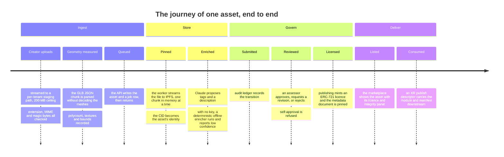

### A.2 2. System architecture

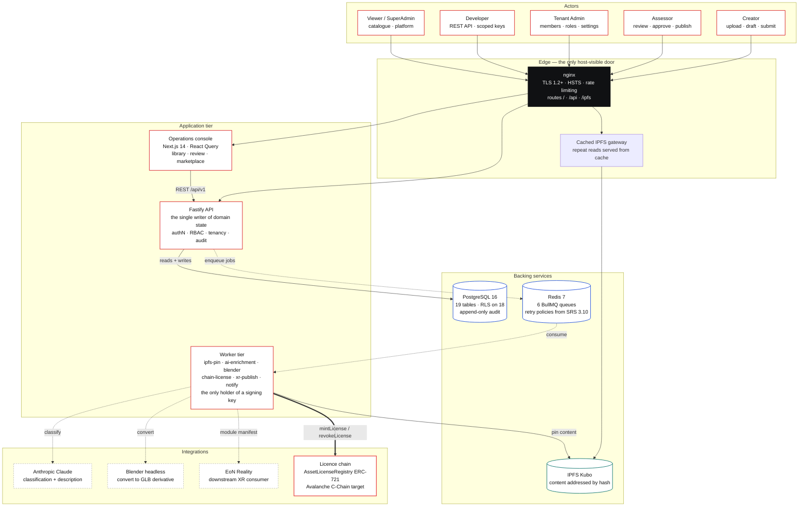

### A.3 2. System architecture

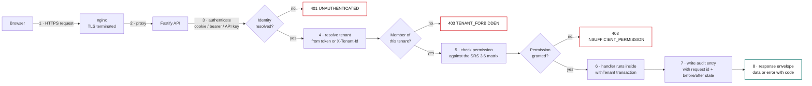

### A.4 6. Multi-tenancy & row-level security

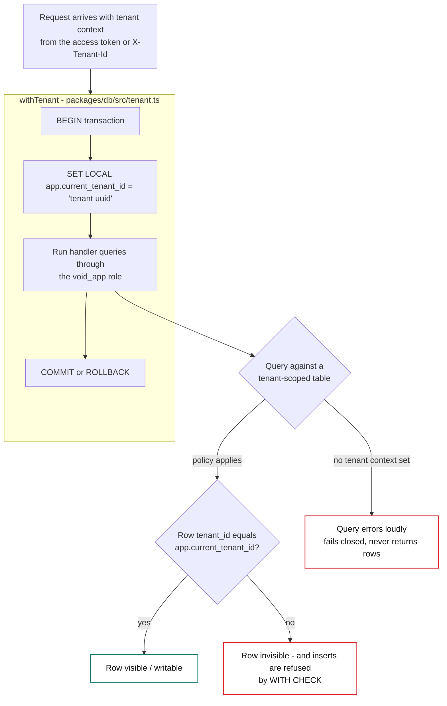

### A.5 7. Asset lifecycle state machine

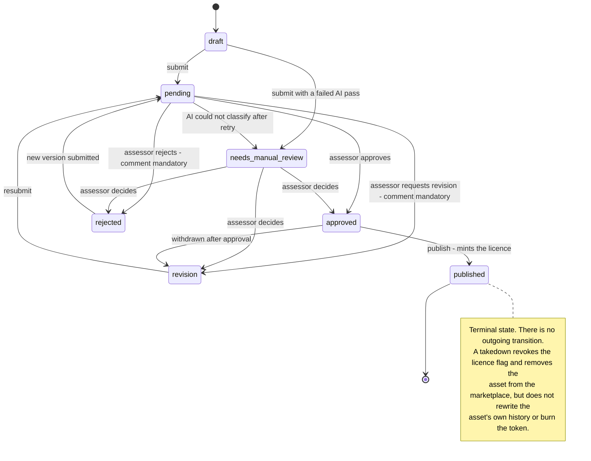

### A.6 8. Ingestion pipeline

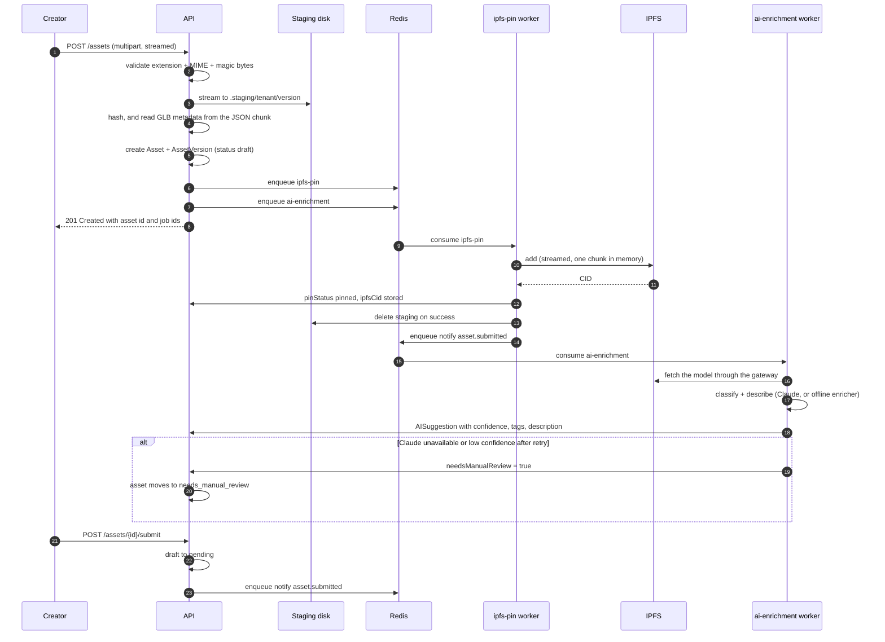

### A.7 9. Publication & licensing

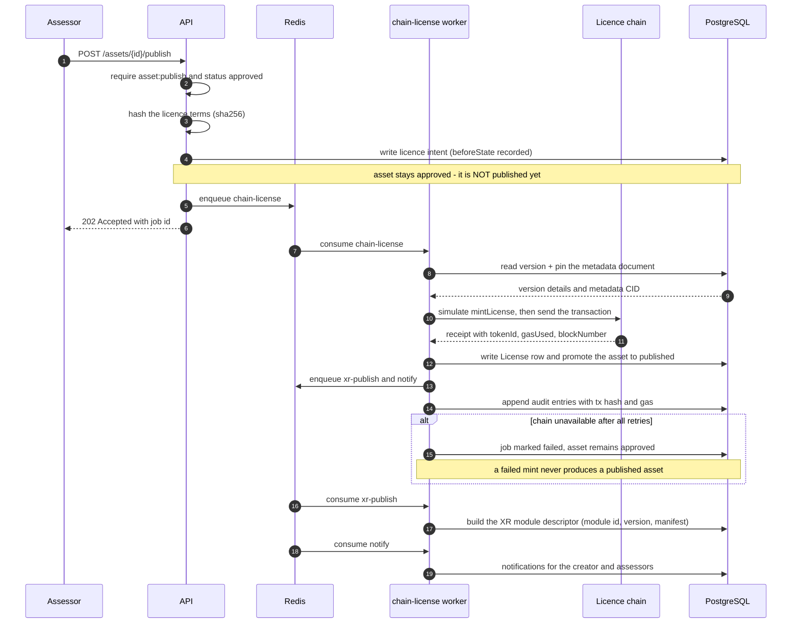

### A.8 10.3 Signing boundary

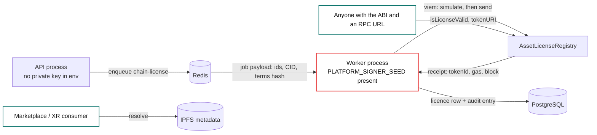

### A.9 10.4 Chain target: local EVM today, Avalanche C-Chain in production

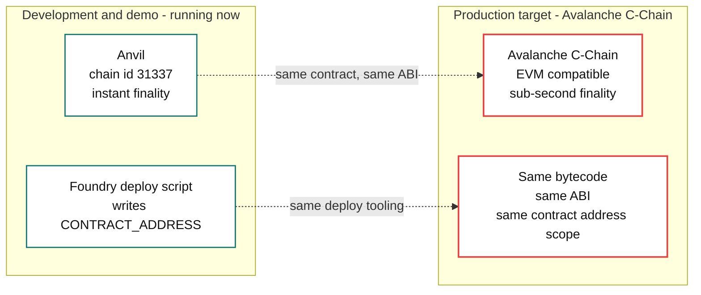

### A.10 11. Asynchronous job platform

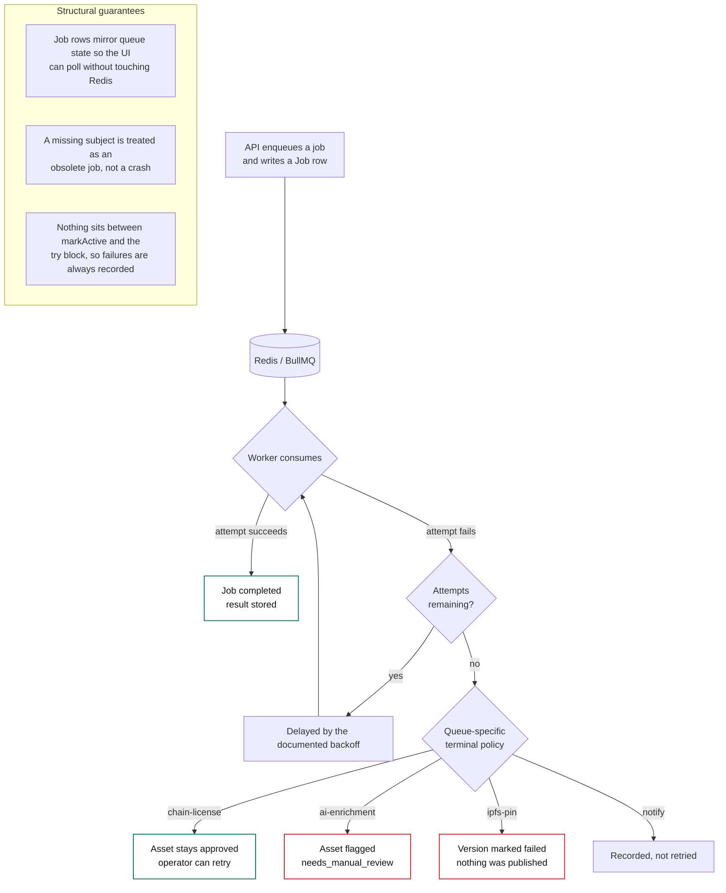

### A.11 12. Data model

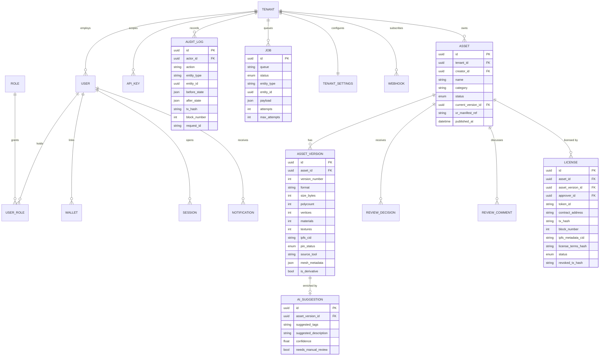

### A.12 14. Frontend architecture

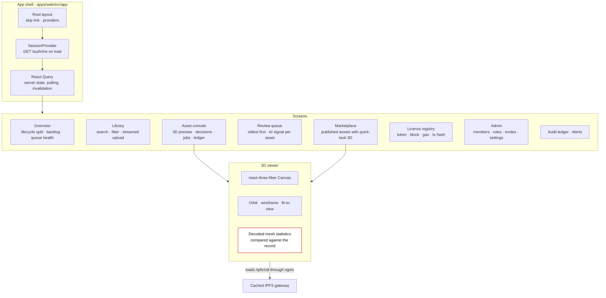

### A.13 15. Content storage & addressing

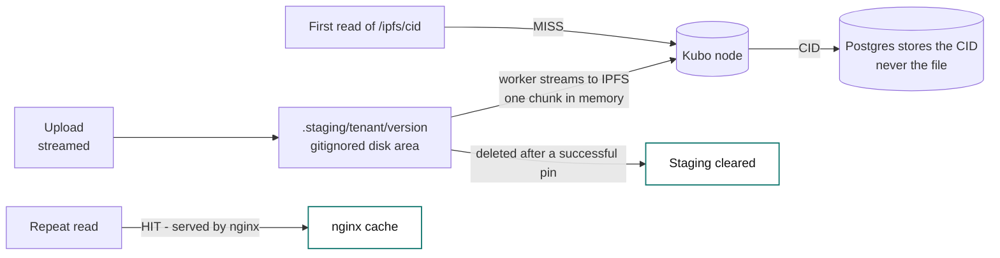

### A.14 16. Observability, audit & traceability

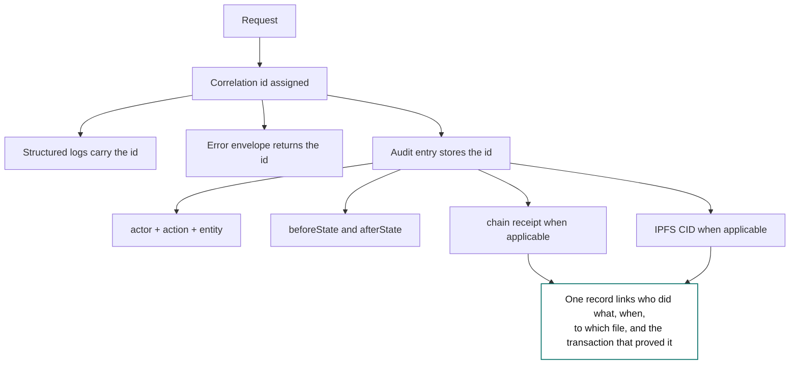

### A.15 18. Deployment & runtime topology

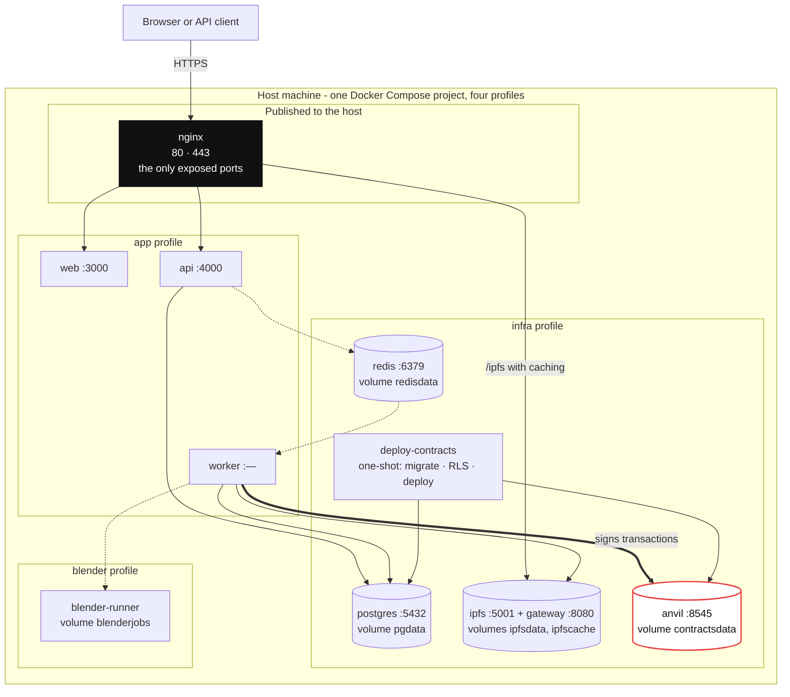

### A.16 21. Verification & test coverage

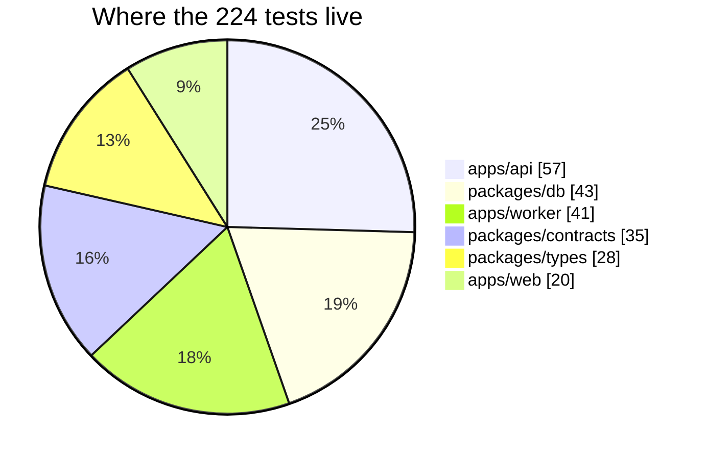

### A.17 22. Roadmap: designed, not yet built

```mermaid
flowchart LR
    subgraph DONE["Built and verifiable today"]
        D1["Ingestion · IPFS · AI · review"]
        D2["Licensing on chain · takedown"]
        D3["Console · audit · in-app notifications"]
        D4["RBAC · RLS · SSO · SIWE · API keys"]
    end
    subgraph NEXT["Designed, adapter pending"]
        N1["Blender auto-conversion<br/>queue and worker exist"]
        N2["EoN Reality push<br/>xr-publish builds the descriptor"]
        N3["Importers: Sketchfab · Poly Pizza · Meshy<br/>source columns and keys reserved"]
        N4["Outbound webhooks<br/>table and event list defined"]
        N5["Email delivery<br/>notifications are in-app only"]
    end
    subgraph LATER["Production hardening"]
        L1["Avalanche C-Chain + managed signer"]
        L2["IPFS pinning service · replicated"]
        L3["Horizontal worker scaling"]
        L4["Public anonymous catalogue<br/>needs a deliberate cross-tenant read"]
        L5["Playwright end-to-end browser suite"]
    end
    DONE --> NEXT --> LATER

    classDef done fill:#fff,stroke:#0f766e,stroke-width:1.5px,color:#111
    classDef next fill:#fff,stroke:#d81f26,stroke-width:1.5px,color:#111
    classDef later fill:#fff,stroke:#c3c3bb,stroke-width:1.5px,color:#111
    class D1,D2,D3,D4 done
    class N1,N2,N3,N4,N5 next
    class L1,L2,L3,L4,L5 later
```

### A.18 22. Roadmap: designed, not yet built

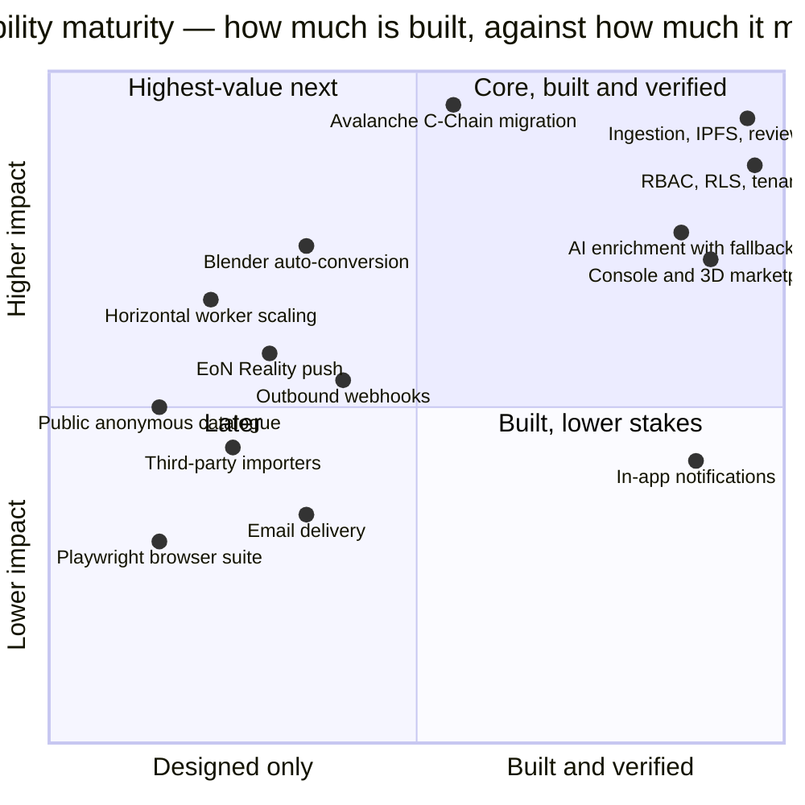

The final two blocks (test distribution, capability maturity) are screen-only plots with no ASCII twin in the body: the same data appears as a bar chart in §21 and as a matrix in §22.1. Where a twin and a body diagram disagree, the body is authoritative.
